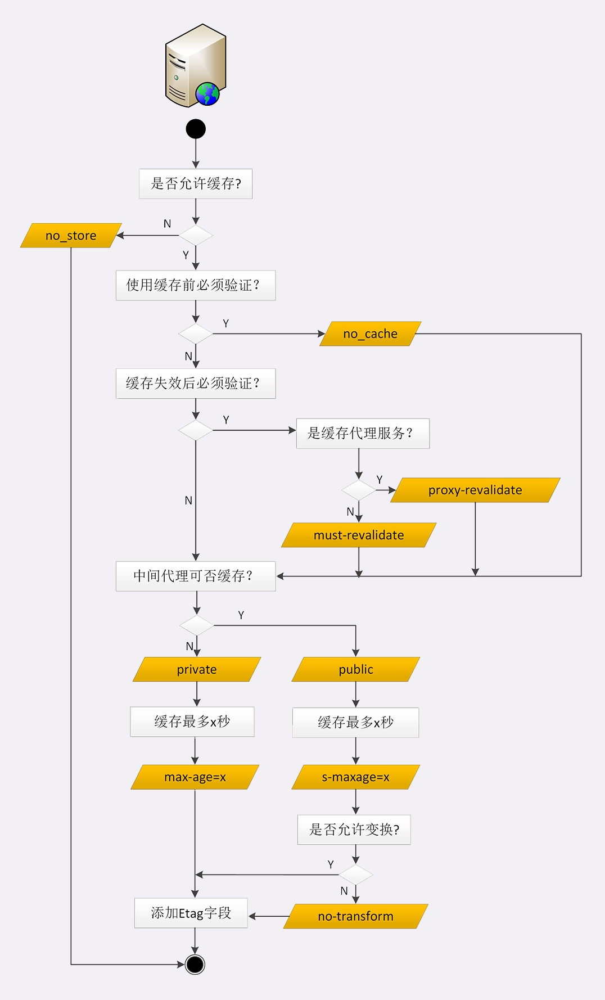
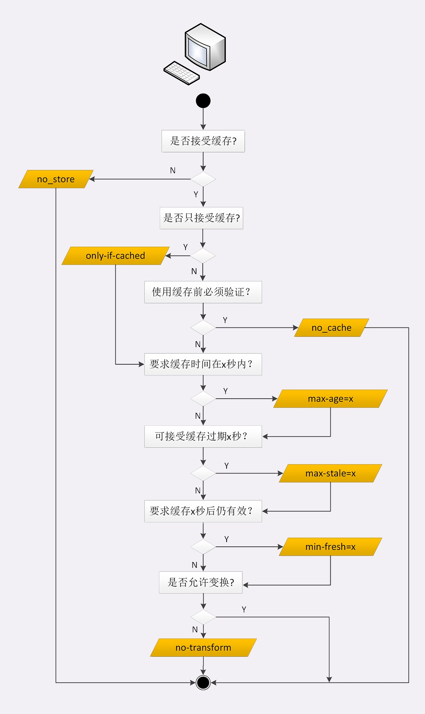

# 代理缓存

> 客户端的缓存只是用户自己使用，而代理的缓存可能会为非常多的客户端提供服务。所以，需要对它的缓存再多一些限制条件。首先，要区分客户端上的缓存和代理上的缓存，可以使用两个新属性 private 和 public。private 表示缓存只能在客户端保存，是用户私有的，不能放在代理上与别人共享。而 public 的意思就是缓存完全开放

> must-revalidate 是只要过期就必须回源服务器验证，而 proxy-revalidate 只要求代理的缓存过期后必须验证，客户端不必回源

> 缓存的生存时间可以使用新的 s-maxage，只限定在代理上能够存多久，而客户端仍然使用 max_age

> max-stale 表示如果代理上的缓存过期了也可以接受，但不能过期太多，超过 x 秒也会不要。min-fresh 的意思是缓存必须有效，而且必须在 x 秒后依然有效