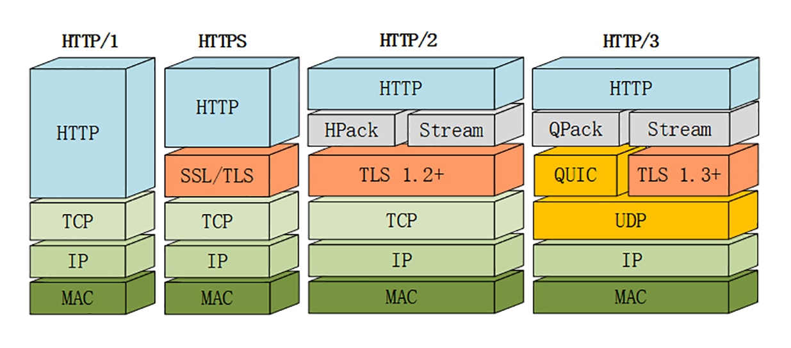

# QUIC

> HTTP/2 把多个请求 - 响应分解成流，交给 TCP 后，TCP 会再拆成更小的包依次发送。在网络良好的情况下，包可以很快送达目的地。但如果网络质量比较差，就有可能会丢包。而 TCP 为了保证可靠传输，丢失的包必须要等待重新传输确认，其他的包即使已经收到了，也只能放在缓冲区里，上层的应用拿不出来

> HTTP over QUIC 是 HTTP 协议的下一个大版本，HTTP/3。它在 HTTP/2 的基础上又实现了质的飞跃，真正地解决了队头阻塞问题

## QUIC 协议
> HTTP/3 有一个关键的改变，就是把下层的 TCP 换成了 UDP。因为 UDP 是无序的，包之间没有依赖关系，所以就从根本上解决了队头阻塞

> UDP 是一个简单、不可靠的传输协议，只是对 IP 协议的一层很薄的包装。正是因为它简单，不需要建连和断连，通信成本低，也就非常灵活、高效，可塑性很强。QUIC 在 UDP 之上，把 TCP 中的连接管理、拥塞窗口、流量控制等搬了过来，打造出了一个全新的可靠传输协议

> QUIC 基于 UDP 实现了可靠传输，保证数据一定能够抵达目的地。它还引入了类似 HTTP/2 的流和多路复用，单个流是有序的，可能会因为丢包而阻塞，但其他流不会受到影响

> 为了防止网络上的中间设备（Middle Box）识别协议的细节，QUIC 全面采用加密通信，可以很好地抵御窜改和协议僵化（ossification）

> QUIC 就直接应用了 TLS1.3。但 QUIC 并不是建立在 TLS 之上，而是内部包含了 TLS。它使用自己的帧接管了 TLS 里的记录，握手消息、警报消息都不使用 TLS 记录，直接封装成 QUIC 的帧发送，省掉了一次开销

> QUIC 的基本数据传输单位是包（packet）和帧（frame），一个包由多个帧组成，包面向的是连接，帧面向的是流

> QUIC 的帧里有多种类型，PING、ACK 等帧用于管理连接，而 STREAM 帧专门用来实现流

> QUIC 里的流与 HTTP/2 的流非常相似，也是帧的序列。但 HTTP/2 里的流都是双向的，而 QUIC 则分为双向流和单向流

> QUIC 使用不透明的连接 ID 来标记通信的两个端点，客户端和服务器可以自行选择一组 ID 来标记自己，这样就解除了 TCP 里连接对IP 地址 + 端口的强绑定，支持连接迁移（Connection Migration）

## HTTP/3 服务发现
> 浏览器需要先用 HTTP/2 协议连接服务器，然后服务器可以在启动 HTTP/2 连接后发送一个 Alt-Svc 帧，包含一个 h3=host:port 的字符串，告诉浏览器在另一个端点上提供等价的 HTTP/3 服务。浏览器收到 Alt-Svc 帧，会使用 QUIC 异步连接指定的端口，如果连接成功，就会断开 HTTP/2 连接，改用新的 HTTP/3 收发数据