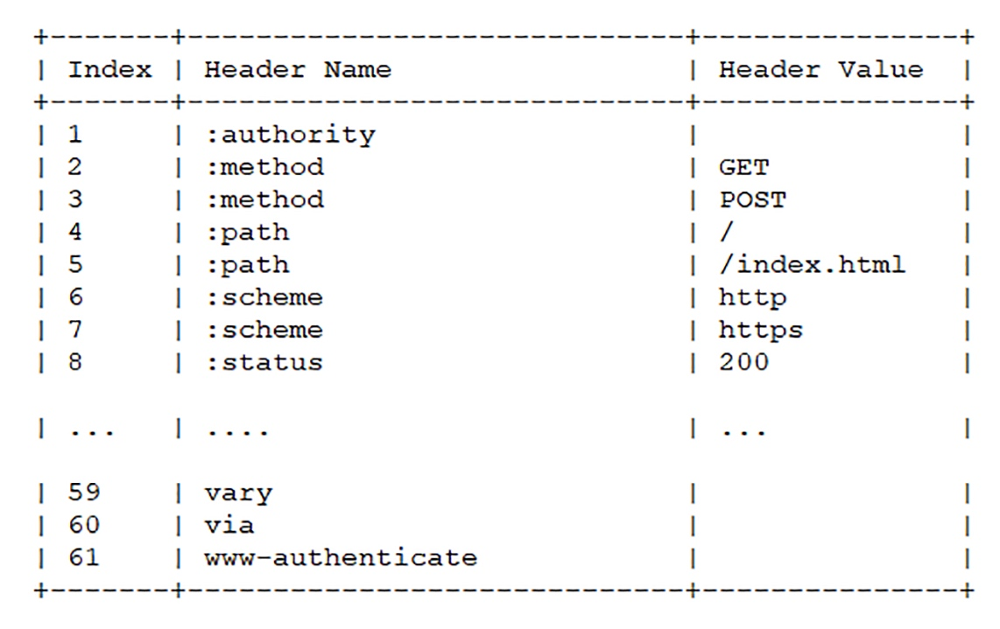
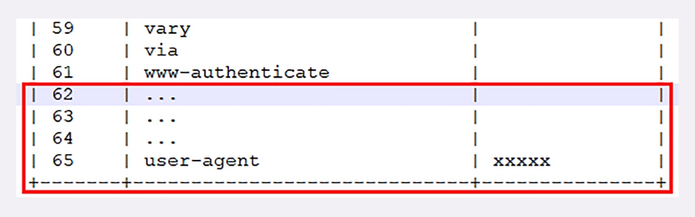
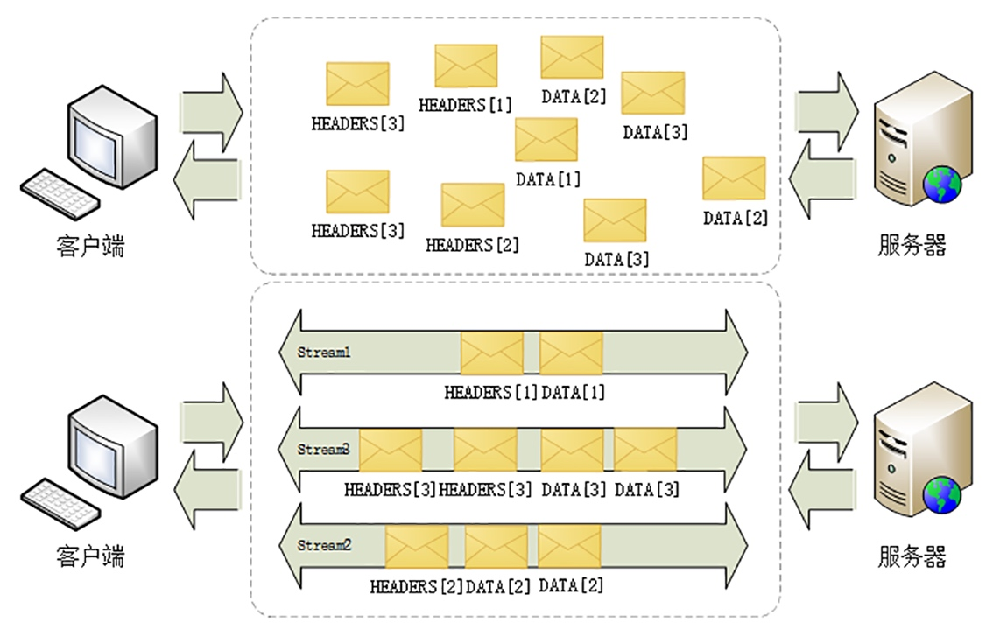
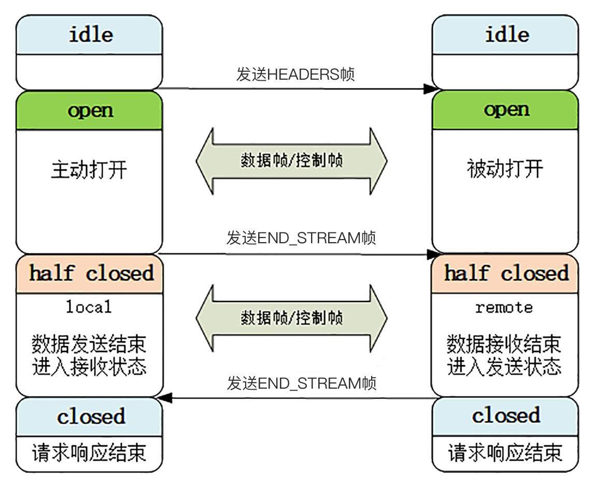
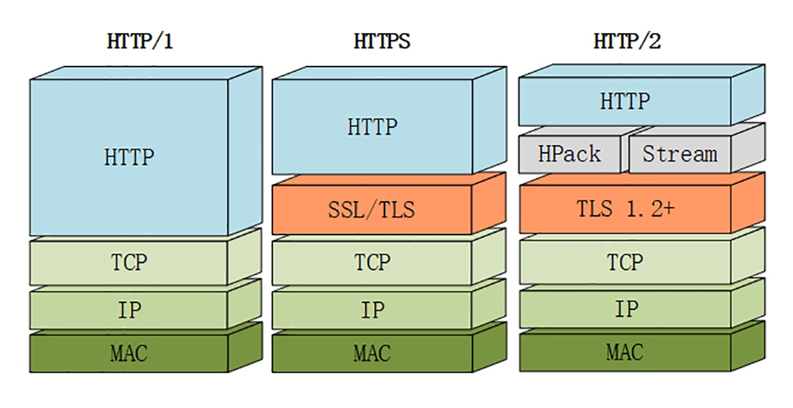

# HTTP2

## 头部压缩
> 开发了专门的 HPACK 算法，在客户端和服务器两端建立字典，用索引号表示重复的字符串，还釆用哈夫曼编码来压缩整数和字符串，可以达到 50%~90% 的高压缩率

> 与 gzip、zlib 等压缩算法不同，HPACK 是一个有状态的算法，需要客户端和服务器各自维护一份索引表，压缩和解压缩就是查表和更新表的操作。

> HTTP/2 废除了原有的起始行概念，把起始行里面的请求方法、URI、状态码等统一转换成了头字段的形式，称做伪头字段（pseudo-header fields）。为了与真头字段区分开来，这些伪头字段会在名字前加一个 “:”，比如 “:method”、“:status”

> HTTP/2 就为一些最常用的头字段定义了一个只读的静态表（Static Table），只要查表就可以知道字段名和对应的值

> 如果表里只有 Key 没有 Value，或者是自定义字段根本找不到，就要用到动态表（Dynamic Table），它添加在静态表后面，结构相同，但会在编码解码的时候随时更新。比如说，第一次发送请求时的 user-agent 字段长是一百多个字节，用哈夫曼压缩编码发送之后，客户端和服务器都更新自己的动态表，添加一个新的索引号 65。那么下一次发送的时候就只要用一个字节发送编号就好

## 二进制格式
> HTTP 把原来的 Header + Body 的消息打散为数个小片的二进制帧，用 HEADERS 帧存放头数据、DATA 帧存放实体数据

## 虚拟的流
> HTTP/2 定义了一个流的概念，它是二进制帧的双向传输序列，同一个消息往返的帧会分配一个唯一的流 ID。在流里面的数据帧有着先后顺序，这些数据帧按照次序组装起来就是请求报文和响应报文

> 因为流是虚拟的，所以 HTTP/2 就可以在一个 TCP 连接上用流同时发送多个碎片化的消息，这就是多路复用

> HTTP/2 的多路复用特性要求对一个域名（或者 IP）只用一个 TCP 连接

> 在流的层面上看，消息是一些有序的帧序列，而在连接的层面上看，消息却是乱序收发的帧。多个请求 / 响应之间没有了顺序关系，不需要排队等待，也就不会再出现队头阻塞问题，降低了延迟，大幅度提高了连接的利用率

> 为了更好地利用连接，加大吞吐量，HTTP/2 还添加了一些控制帧来管理虚拟的流，实现了优先级和流量控制

> HTTP/2 还在一定程度上改变了传统的请求 - 应答工作模式，服务器不再是完全被动地响应请求，也可以新建流主动向客户端发送消息。比如，在浏览器刚请求 HTML 的时候就提前把可能会用到的 JS、CSS 文件发给客户端，减少等待的延迟，这被称为服务器推送（Server Push，也叫 Cache Push）

> 1. 流是可并发的，一个 HTTP/2 连接上可以同时发出多个流传输数据，也就是并发多请求，实现多路复用
> 2. 客户端和服务器都可以创建流，双方互不干扰
> 3. 流是双向的，一个流里面客户端和服务器都可以发送或接收数据帧，也就是一个请求 - 应答来回
> 4. 流之间没有固定关系，彼此独立，但流内部的帧是有严格顺序的
> 5. 流可以设置优先级，让服务器优先处理，比如先传 HTML/CSS，后传图片，优化用户体验
> 6. 流 ID 不能重用，只能顺序递增，客户端发起的 ID 是奇数，服务器端发起的 ID 是偶数
> 7. 在流上发送 RST_STREAM 帧可以随时终止流，取消接收或发送
> 8. 第 0 号流比较特殊，不能关闭，也不能发送数据帧，只能发送控制帧，用于流量控制

> 最开始的时候流都是空闲（idle）状态，也就是不存在

> 当客户端发送 HEADERS 帧后，有了流 ID，流就进入了打开状态，两端都可以收发数据

> 客户端发送一个带 END_STREAM 标志位的帧，流就进入了半关闭状态

> 半关闭状态意味着客户端的请求数据已经发送完了，需要接受响应数据，而服务器端也知道请求数据接收完毕，之后就要内部处理，再发送响应数据

> 响应数据发完了之后，也要带上 END_STREAM 标志位，表示数据发送完毕，这样流两端就都进入了关闭状态，流就结束了

> 流 ID 不能重用，所以流的生命周期就是 HTTP/1 里的一次完整的请求 - 应答，流关闭就是一次通信结束。下一次再发请求就要开一个新流（而不是新连接），流 ID 不断增加，直到到达上限，发送 GOAWAY 帧开一个新的 TCP 连接，流 ID 就又可以重头计数

## 协议栈

