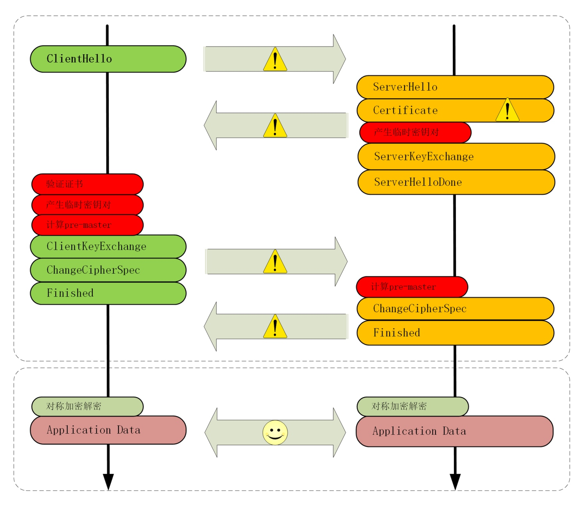
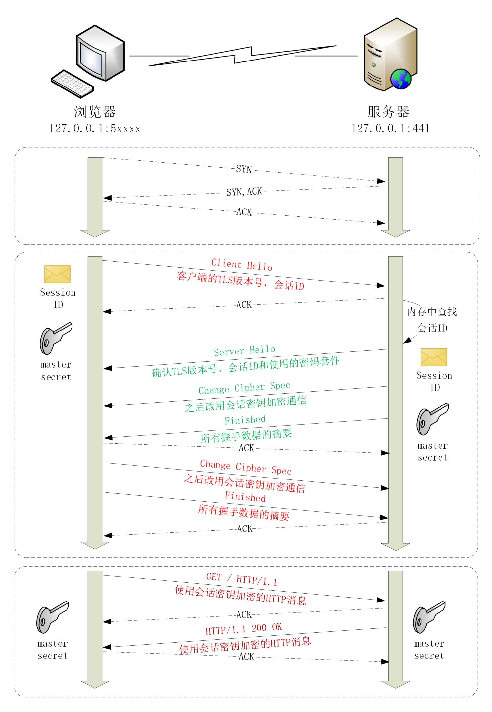

# HTTPS 优化



## 硬件优化
> HTTPS 连接是计算密集型，而不是 I/O 密集型
> 1. 选择更快的 CPU，最好还内建 AES 优化，这样即可以加速握手，也可以加速传输
> 2. 选择SSL 加速卡，加解密时调用它的 API，让专门的硬件来做非对称加解密，分担 CPU 的计算压力
> 3. SSL 加速卡也有一些缺点，比如升级慢、支持算法有限，不能灵活定制解决方案等。所以，就出现了 SSL 加速服务器，用专门的服务器集群来彻底卸载 TLS 握手时的加密解密计算，性能比单纯的加速卡要强大的多

## 软件优化
> 软件方面的优化还可以再分成两部分：一个是软件升级，一个是协议优化

### 软件升级
> 把现在正在使用的软件尽量升级到最新版本，比如把 Linux 内核由 2.x 升级到 4.x，把 Nginx 由 1.6 升级到 1.16，把 OpenSSL 由 1.0.1 升级到 1.1.0/1.1.1。这些软件在更新版本的时候都会做性能优化、修复错误

### 协议优化
> 应当尽量采用 TLS1.3，它大幅度简化了握手的过程，完全握手只要 1-RTT，而且更加安全

> 如果暂时不能升级到 1.3，只能用 1.2，那么握手时使用的密钥交换协议应当尽量选用椭圆曲线的 ECDHE 算法。它不仅运算速度快，安全性高，还支持 False Start，能够把握手的消息往返由 2-RTT 减少到 1-RTT，达到与 TLS1.3 类似的效果

> 另外，椭圆曲线也要选择高性能的曲线，最好是 x25519，次优选择是 P-256。对称加密算法方面，也可以选用 AES_128_GCM，它能比 AES_256_GCM 略快一点点

> 在 Nginx 里可以用 ssl_ciphers, ssl_ecdh_curve 等指令配置服务器使用的密码套件和椭圆曲线

```nginx
ssl_ciphers   TLS13-AES-256-GCM-SHA384:TLS13-CHACHA20-POLY1305-SHA256:EECDH+CHACHA20；
ssl_ecdh_curve              X25519:P-256;
```

## 证书优化
> 除了密钥交换，握手过程中的证书验证也是一个比较耗时的操作，服务器需要把自己的证书链全发给客户端，然后客户端接收后再逐一验证

> 服务器的证书可以选择椭圆曲线（ECDSA）证书而不是 RSA 证书，因为 224 位的 ECC 相当于 2048 位的 RSA，所以椭圆曲线证书要比 RSA 小很多，能够节约带宽也能减少客户端的运算量

> 客户端的证书验证是个很复杂的操作，除了要公钥解密验证多个证书签名外，因为证书还有可能会被撤销失效，客户端有时还会再去访问 CA，下载 CRL 或者 OCSP 数据，这又会产生 DNS 查询、建立连接、收发数据等一系列网络通信，增加好几个 RTT

> CRL（Certificate revocation list，证书吊销列表）由 CA 定期发布，里面是所有被撤销信任的证书序号，查询这个列表就可以知道证书是否有效。但 CRL 因为是定期发布，就有时间窗口的安全隐患，而且随着吊销证书的增多，列表会越来越大，一个 CRL 经常会上 MB。如果每次需要预先下载几 M 的无用数据才能连接网站，实用性实在是太低了

> 所以，现在 CRL 基本上不用了，取而代之的是 OCSP（在线证书状态协议，Online Certificate Status Protocol），向 CA 发送查询请求，让 CA 返回证书的有效状态。但 OCSP 也要多出一次网络请求的消耗，而且还依赖于 CA 服务器，如果 CA 服务器很忙，那响应延迟也是等不起的

> 于是又出来了一个补丁，叫 OCSP Stapling（OCSP 装订），它可以让服务器预先访问 CA 获取 OCSP 响应，然后在握手时随着证书一起发给客户端，免去了客户端连接 CA 服务器查询的时间

## 会话复用
### Session ID
> 客户端和服务器首次连接后各自保存一个会话的 ID 号，内存里存储主密钥和其他相关的信息。当客户端再次连接时发一个 ID 过来，服务器就在内存里找，找到就直接用主密钥恢复会话状态，跳过证书验证和密钥交换，只用一个消息往返就可以建立安全通信



### 会话票证
> Session ID 是最早出现的会话复用技术，也是应用最广的，但它也有缺点，服务器必须保存每一个客户端的会话数据，对于拥有百万、千万级别用户的网站来说存储量就成了大问题，加重了服务器的负担

> 于是，又出现了 Session Ticket 方案。它有点类似 HTTP 的 Cookie，存储的责任由服务器转移到了客户端，服务器加密会话信息，用 New Session Ticket 消息发给客户端，让客户端保存。重连的时候，客户端使用扩展 session_ticket 发送 Ticket 而不是 Session ID，服务器解密后验证有效期，就可以恢复会话，开始加密通信

> 不过 Session Ticket 方案需要使用一个固定的密钥文件（ticket_key）来加密 Ticket，为了防止密钥被破解，保证前向安全，密钥文件需要定期轮换，比如设置为一小时或者一天

### 预共享密钥
> 在发送 Ticket 的同时会带上应用数据（Early Data），免去了 1.2 里的服务器确认步骤，这种方式叫 Pre-shared Key，简称为 PSK。PSK 为了追求效率而牺牲了一点安全性，容易受到重放攻击（Replay attack）的威胁。黑客可以截获 PSK 的数据，像复读机那样反复向服务器发送

> 解决的办法是只允许安全的 GET/HEAD 方法，在消息里加入时间戳、nonce 验证，或者一次性票证限制重放