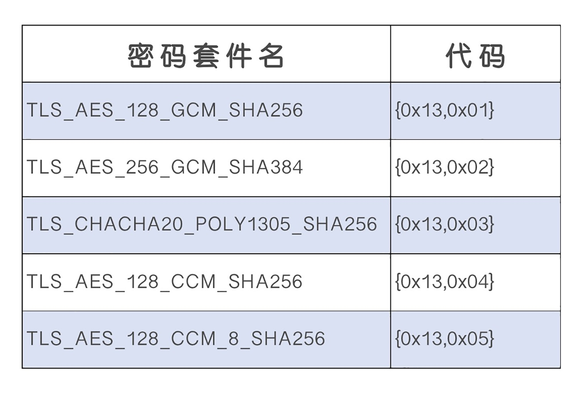
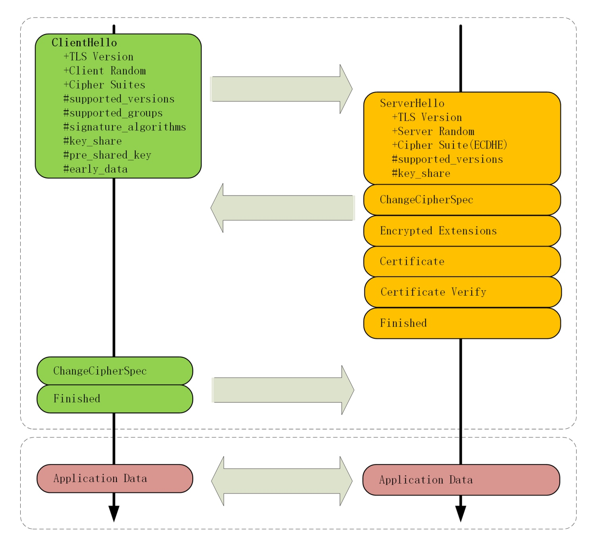
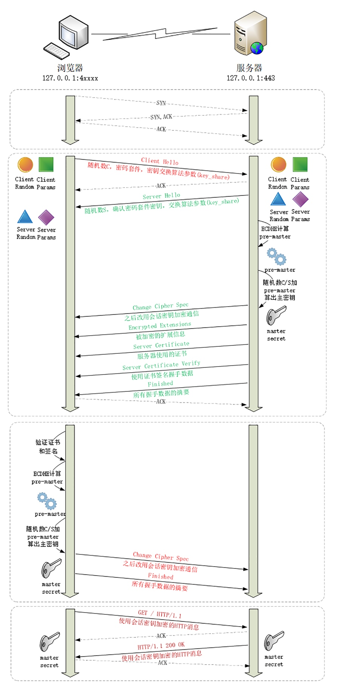

# TLS1.3

## 兼容性
> 添加扩展协议，通过在记录末尾添加一系列的扩展字段来增加新的功能，实现了后向兼容

> 在记录头的 Version 字段被兼容性固定的情况下，只要是 TLS1.3 协议，握手的 Hello 消息后面就必须有 supported_versions 扩展，它标记了 TLS 的版本号，使用它就能区分新旧协议

## 强化安全
> 1. 伪随机数函数由 PRF 升级为 HKDF（HMAC-based Extract-and-Expand Key Derivation Function）
> 2. 明确禁止在记录协议里使用压缩
> 3. 废除了 RC4、DES 对称加密算法
> 4. 废除了 ECB、CBC 等传统分组模式
> 5. 废除了 MD5、SHA1、SHA-224 摘要算法
> 6. 废除了 RSA、DH 密钥交换算法和许多命名曲线

> TLS1.3 里只保留了 AES、ChaCha20 对称加密算法，分组模式只能用 AEAD 的 GCM、CCM 和 Poly1305，摘要算法只能用 SHA256、SHA384，密钥交换算法只有 ECDHE 和 DHE，椭圆曲线也只剩 P-256 和 x25519 等 5 种

> 原来众多的算法、参数组合导致密码套件非常复杂，难以选择，而现在的 TLS1.3 里只有 5 个套件

## 提升性能
> HTTPS 建立连接时除了要做 TCP 握手，还要做 TLS 握手，在 1.2 中会多花两个消息往返（2-RTT），可能导致几十毫秒甚至上百毫秒的延迟，在移动网络中延迟还会更严重

> TLS1.3 压缩了以前的 Hello 协商过程，删除了 Key Exchange 消息，把握手时间减少到了 1-RTT，效率提高了一倍

> 具体的做法还是利用了扩展。客户端在 Client Hello 消息里直接用 supported_groups 带上支持的曲线，比如 P-256、x25519，用 key_share 带上曲线对应的客户端公钥参数，用 signature_algorithms 带上签名算法

> 服务器收到后在这些扩展里选定一个曲线和参数，再用 key_share 扩展返回服务器这边的公钥参数，就实现了双方的密钥交换，后面的流程就和 1.2 基本一样了

## 握手分析

> 目前 Nginx 等 Web 服务器都能够很好地支持 TLS1.3，但要求底层的 OpenSSL 必须是 1.1.1

> 在 TCP 建立连接之后，浏览器首先还是发一个 Client Hello。因为 1.3 的消息兼容 1.2，所以开头的版本号、支持的密码套件和随机数（Client Random）结构都是一样的（不过这时的随机数是 32 个字节）。Client Hello 里的扩展，supported_versions 表示这是 TLS1.3，supported_groups 是支持的曲线，key_share 是曲线对应的参数

> 服务器收到 Client Hello 同样返回 Server Hello 消息，还是要给出一个随机数（Server Random）和选定密码套件。supported_versions 里确认使用的是 TLS1.3，然后在 key_share 扩展带上曲线和对应的公钥参数

> 这时只交换了两条消息，客户端和服务器就拿到了四个共享信息：Client Random 和 Server Random、Client Params 和 Server Params，两边就可以各自用 ECDHE 算出 Pre-Master，再用 HKDF 生成主密钥 Master Secret，效率比 TLS1.2 提高了一大截

> 在算出主密钥后，服务器立刻发出 Change Cipher Spec 消息，比 TLS1.2 提早进入加密通信，后面的证书等就都是加密的了，减少了握手时的明文信息泄露

> 这里 TLS1.3 还有一个安全强化措施，多了个 Certificate Verify 消息，用服务器的私钥把前面的曲线、套件、参数等握手数据加了签名，作用和 Finished 消息差不多。但由于是私钥签名，所以强化了身份认证和和防窜改

> 这两个 Hello 消息之后，客户端验证服务器证书，再发 Finished 消息，就正式完成了握手，开始收发 HTTP 报文

