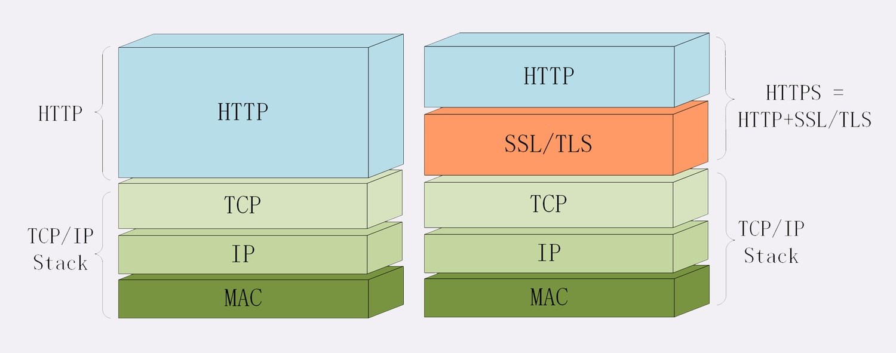
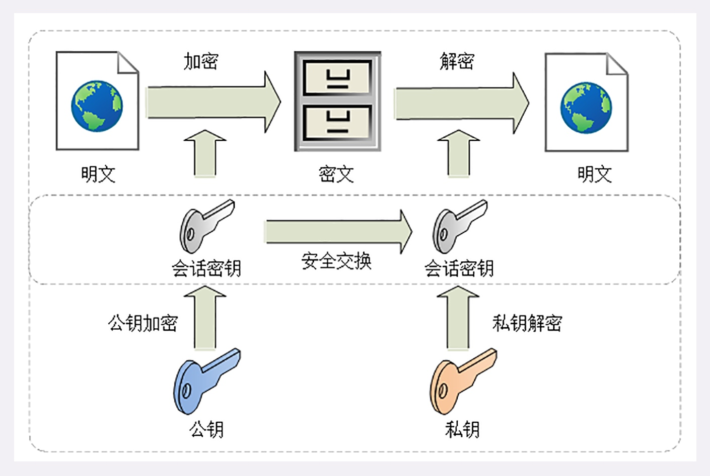
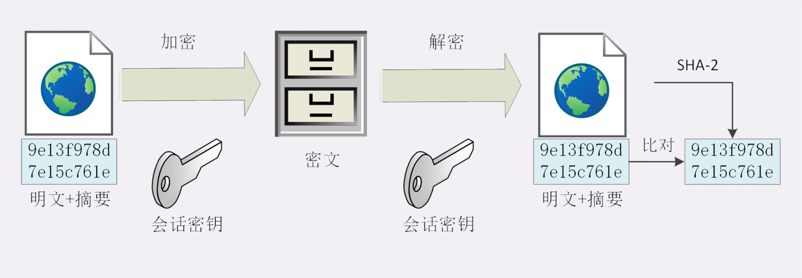
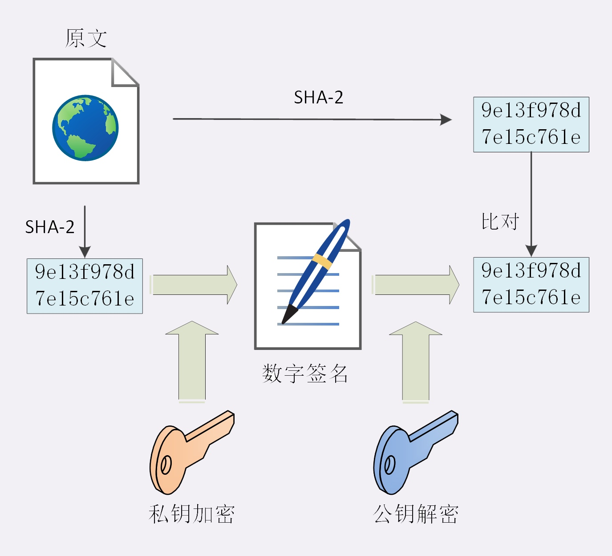
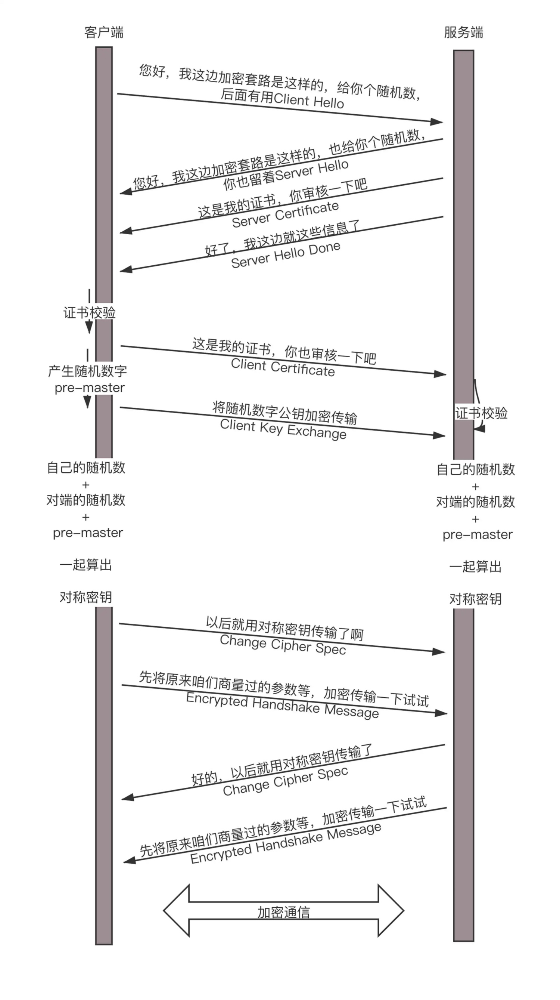

# HTTPS

> HTTPS 是运行在 SSL/TLS 协议上的 HTTP

## 安全
> 1. 机密性
> 2. 完整性
> 3. 身份认证
> 4. 不可否认

## SSL/TLS
> SSL/TLS 是一个负责加密通信的安全协议，建立在 TCP/IP 之上，所以也是个可靠的传输协议



> SSL 的全称是 Secure Socket Layer，后来改名为 TLS，即 Transport Layer Security

> 浏览器和服务器在使用 TLS 建立连接时需要选择一组恰当的加密算法来实现安全通信，这些算法的组合被称为密码套件（cipher suite，也叫加密套件）

> TLS 的密码套件命名非常规范，格式很固定。基本的形式是：
> 密钥交换算法 + 签名算法 + 对称加密算法 + 摘要算法

> 比如 ECDHE-RSA-AES256-GCM-SHA384 密码套件的意思就是：握手时使用 ECDHE 算法进行密钥交换，用 RSA 签名和身份认证，握手后的通信使用 AES 对称算法，密钥长度 256 位，分组模式是 GCM，摘要算法 SHA384 用于消息认证和产生随机数

## 对称加密
> AES 的意思是高级加密标准（Advanced Encryption Standard），密钥长度可以是 128、192 或 256。它是 DES 算法的替代者，安全强度很高，性能也很好，而且有的硬件还会做特殊优化，是应用最广泛的对称加密算法

> ChaCha20 是 Google 设计的另一种加密算法，密钥长度固定为 256 位，纯软件运行性能要超过 AES，曾经在移动客户端上比较流行，但 ARMv8 之后也加入了 AES 硬件优化，所以现在不再具有明显的优势

> 对称算法还有一个分组模式的概念，它可以让算法用固定长度的密钥加密任意长度的明文。最早有 ECB、CBC、CFB、OFB 等几种分组模式，但都陆续被发现有安全漏洞。最新的分组模式被称为 AEAD（Authenticated Encryption with Associated Data），在加密的同时增加了认证的功能，常用的是 GCM、CCM 和 Poly1305

## 非对称加密
> 对称加密看有一个很大的问题：如何把密钥安全地传递给对方

> 非对称加密有两个密钥，一个叫公钥（public key），一个叫私钥（private key）。公钥可以公开给任何人使用，而私钥必须严格保密。公钥加密后只能用私钥解密，私钥加密后也只能用公钥解密

> 非对称加密可以解决密钥交换的问题：网站秘密保管私钥，在网上任意分发公钥。因为黑客因为没有私钥，所以就无法破解密文

> TLS 里的非对称加密算法有 DH、DSA、RSA、ECC 等。RSA 可能是其中最著名的一个，10 年前 RSA 密钥的推荐长度是 1024，但随着计算机运算能力的提高，现在 1024 已经不安全，普遍认为至少要 2048 位。ECC（Elliptic Curve Cryptography）是非对称加密里的后起之秀，它基于椭圆曲线离散对数的数学难题，使用特定的曲线方程和基点生成公钥和私钥，子算法 ECDHE 用于密钥交换，ECDSA 用于数字签名

> 比起 RSA，ECC 在安全强度和性能上都有明显的优势。160 位的 ECC 相当于 1024 位的 RSA，而 224 位的 ECC 则相当于 2048 位的 RSA。因为密钥短，所以相应的计算量、消耗的内存和带宽也就少，加密解密的性能就上去了

## 混合加密
> 虽然非对称加密没有密钥交换的问题，但因为它们的运算速度很慢，即使是 ECC 也要比 AES 差上好几个数量级。如果仅用非对称加密，虽然保证了安全，但通信速度特别慢

> TLS 使用混合加密方式：在通信刚开始的时候使用非对称算法，首先解决密钥交换的问题。然后用随机数产生对称算法使用的会话密钥（session key），再用公钥加密。因为会话密钥很短，通常只有 16 字节或 32 字节，所以慢一点也无所谓。对方拿到密文后用私钥解密，取出会话密钥。这样，双方就实现了对称密钥的安全交换，后续就不再使用非对称加密，全都使用对称加密



## 摘要算法



> 黑客虽然拿不到会话密钥，无法破解密文，但可以通过窃听收集到足够多的密文，再尝试着修改、重组后发给网站。因为没有完整性保证，服务器只能照单全收，然后黑客就可以通过服务器的响应获取进一步的线索，最终就会破解出明文

> 另外，黑客也可以伪造身份发布公钥。如果拿到了假的公钥，混合加密就完全失效了。客户端以为自己是在和真的服务器通信，实际上网线的另一端却是黑客

> 实现完整性的手段主要是摘要算法（Digest Algorithm），也就是常说的散列函数、哈希函数（Hash Function）。摘要算法能够把任意长度的数据压缩成固定长度、而且独一无二的摘要字符串

> 摘要算法存在冲突的可能性，可能会有两份不同的原文对应相同的摘要。好的摘要算法必须能够抵抗冲突，让这种可能性尽量地小。因为摘要算法对输入具有单向性和雪崩效应，输入的微小不同会导致输出的剧烈变化，所以也被 TLS 用来生成伪随机数（PRF，pseudo random function）

> 工作中用过的摘要算法 MD5（Message-Digest 5）、SHA-1（Secure Hash Algorithm 1），能够生成 16 字节和 20 字节长度的数字摘要。但这两个算法的安全强度比较低，不够安全，在 TLS 里已经被禁止使了。目前 TLS 推荐使用的是 SHA-1 的后继者：SHA-2。SHA-2 实际上是一系列摘要算法的统称，总共有 6 种，常用的有 SHA224、SHA256、SHA384，分别能够生成 28 字节、32 字节、48 字节的摘要

> 摘要算法保证了数字摘要和原文是完全等价的。所以，我们只要在原文后附上它的摘要，就能够保证数据的完整性。如果黑客在中间改动了一个标点符号，摘要也会完全不同，网站计算比对就会发现消息被窜改，是不可信的

> 摘要算法不具有机密性，如果明文传输，那么黑客可以修改消息后把摘要也一起改了，网站还是鉴别不出完整性。所以，真正的完整性必须要建立在机密性之上，在混合加密系统里用会话密钥加密消息和摘要，这样黑客无法得知明文，也就没有办法动手脚了。这有个术语，叫哈希消息认证码（HMAC）

## 数字签名
> 黑客不仅可以伪装成网站来窃取信息，也可以伪装成客户端，向网站发送支付、转账等消息

> 使用私钥再加上摘要算法，就能够实现数字签名。数字签名的原理其实很简单，就是把公钥私钥的用法反过来，之前是公钥加密、私钥解密，现在是私钥加密、公钥解密。但又因为非对称加密效率太低，所以私钥只加密原文的摘要，这样运算量就小的多，而且得到的数字签名也很小，方便保管和传输

> 签名和公钥一样完全公开，任何人都可以获取。但这个签名只有用私钥对应的公钥才能解开，拿到摘要后，再比对原文验证完整性，就可以像签署文件一样证明消息确实是你发的

> 只要与网站互相交换公钥，就可以用签名和验签来确认消息的真实性，因为私钥保密，黑客不能伪造签名，就能够保证通信双方的身份



## CA
> 因为大家都可以发布公钥，因此还需要有防止黑客伪造公钥的手段。我们通过 CA（Certificate Authority，证书认证机构）给各个公钥签名，用自身的信誉来保证公钥无法伪造，是可信的

> CA 对公钥的签名认证也是有格式的：包含序列号、用途、颁发者、有效时间等等，把这些打成一个包再签名，完整地证明公钥关联的各种信息，形成数字证书（Certificate）。知名的 CA 比如 DigiCert、VeriSign、Entrust、Let’s Encrypt 等，它们签发的证书分 DV、OV、EV 三种，区别在于可信程度

> DV 是最低的，只是域名级别的可信，背后是谁不知道。EV 是最高的，经过了法律和审计的严格核查，可以证明网站拥有者的身份（在浏览器地址栏会显示出公司的名字，例如 Apple、GitHub 的网站）

> 小一点的 CA 可以让大 CA 签名认证，但链条的最后，也就是 Root CA，就只能自己证明自己了，这个就自签名证书（Self-Signed Certificate）或者根证书（Root Certificate）

> 有了证书体系，操作系统和浏览器都内置了各大 CA 的根证书，上网的时候只要服务器发过来它的证书，就可以验证证书里的签名，顺着证书链（Certificate Chain）一层层地验证，直到找到根证书，就能够确定证书是可信的，从而里面的公钥也是可信的

> 证书体系（PKI，Public Key Infrastructure）虽然是目前整个网络世界的安全基础设施，但绝对的安全是不存在的：如果 CA 失误或者被欺骗，签发了错误的证书，虽然证书是真的，可它代表的网站却是假的。还有一种更危险的情况，CA 被黑客攻陷，或者 CA 有恶意，因为它（即根证书）是信任的源头，整个信任链里的所有证书也就都不可信了

> 所以，需要再给证书体系打上一些补丁。针对第一种，开发出了 CRL（证书吊销列表，Certificate revocation list）和 OCSP（在线证书状态协议，Online Certificate Status Protocol），及时废止有问题的证书。对于第二种，因为涉及的证书太多，就只能操作系统或者浏览器从根上下手，撤销对 CA 的信任，列入黑名单，这样它颁发的所有证书就都会被认为是不安全的

```bash
# 创建私钥
openssl genrsa -out www.private.key 1024

# 根据这个私钥，创建对应的公钥
openssl rsa -in www.private.key -pubout -out www.public.pem

# 证书里面有公钥，还有证书的所有者，另外还有证书的发布机构和证书的有效期

# 生成证书需要发起一个证书请求，然后将这个请求发给一个权威机构去认证，这个权威机构称为 CA
# 证书请求生成
openssl req -key www.private.key -new -out www.cert.req

# 将这个请求发给权威机构，权威机构会给这个证书签名。签名算法大概是这样工作的：
# 对信息做 Hash 计算，得到 Hash 值，再把这个 Hash 值加密
openssl x509 -req -in www.cert.req -CA ca.cert.pem -CAkey ca.private.key -out www.cert.pem

# 这个命令会返回 Signature ok，而 www.cert.pem 就是签过名的证书
# CA 用自己的私钥给网站的公钥签名，形成了网站的证书

# 查看这个证书的内容
openssl x509 -in www.cert.pem -noout -text
```

> 要想验证证书，需要 CA 的公钥。然而 CA 的公钥也需要进行确认，因此 CA 的公钥也需要上级的 CA 给它签名，然后形成 CA 的证书。要想知道某个 CA 的证书是否可靠，要看 CA 的上级证书的公钥，能不能解开这个 CA 的签名。这样层层上去，直到全球皆知的几个著名大 CA，称为 root CA。通过这种层层授信背书的方式，从而保证了非对称加密模式的正常运转。除此之外，还有一种证书，称为 Self-Signed Certificate，就是自己给自己签名

