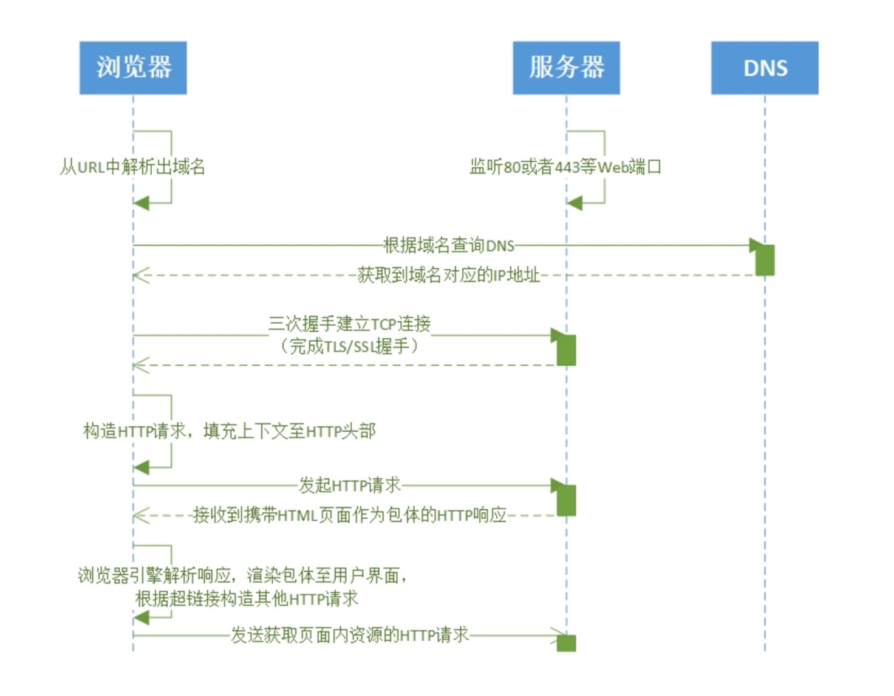
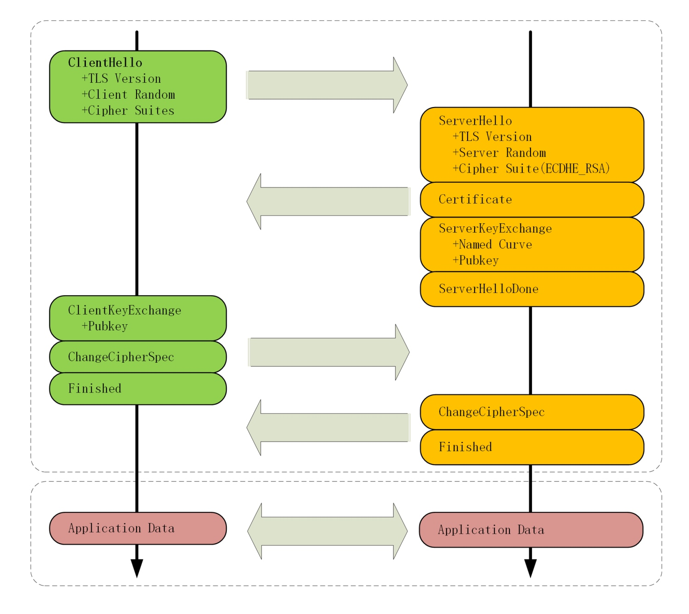
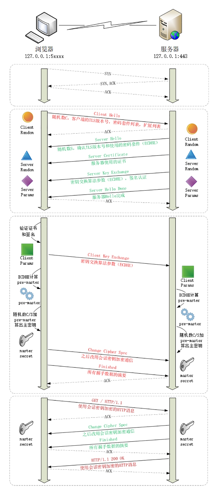
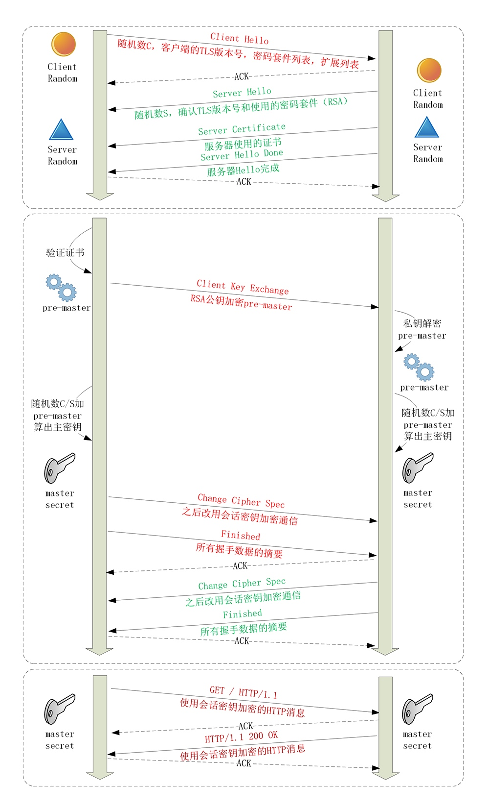

# 请求流程



```
telnet www.baidu.com 80

GET /... HTTP/1.1
Host: www.baidu.com
```

## TLS 协议
### 组成
#### 记录协议（Record Protocol）
> 规定了 TLS 收发数据的基本单位：记录（record），所有的其他子协议都需要通过记录协议发出。但多个记录数据可以在一个 TCP 包里一次性发出，也并不需要像 TCP 那样返回 ACK

#### 警报协议（Alert Protocol）
> 职责是向对方发出警报信息，有点像是 HTTP 协议里的状态码。比如，protocol_version 就是不支持旧版本，bad_certificate 就是证书有问题，收到警报后另一方可以选择继续，也可以立即终止连接

#### 握手协议（Handshake Protocol）
> TLS 里最复杂的子协议，浏览器和服务器会在握手过程中协商 TLS 版本号、随机数、密码套件等信息，然后交换证书和密钥参数，最终双方协商得到会话密钥，用于后续的混合加密系统

#### 变更密码规范协议（Change Cipher Spec Protocol）
> 它非常简单，就是一个通知，告诉对方，后续的数据都将使用加密保护。那么反过来，在它之前，数据都是明文的

> 图中每一个框都是一个记录，多个记录组合成一个 TCP 包发送。所以，最多经过两次消息往返（4 个消息）就可以完成握手，然后就可以在安全的通信环境里发送 HTTP 报文，实现 HTTPS 协议



## ECDHE 握手过程



> 在 TCP 建立连接之后，浏览器会首先发一个 Client Hello 消息，里面有客户端的版本号、支持的密码套件，还有一个随机数（Client Random），用于后续生成会话密钥

```
Handshake Protocol: Client Hello
    Version: TLS 1.2 (0x0303)
    Random: 1cbf803321fd2623408dfe…
    Cipher Suites (17 suites)
        Cipher Suite: TLS_ECDHE_RSA_WITH_AES_128_GCM_SHA256 (0xc02f)
        Cipher Suite: TLS_ECDHE_RSA_WITH_AES_256_GCM_SHA384 (0xc030)
```

> 服务器收到 Client Hello 后，会返回一个 Server Hello 消息。把版本号对一下，也给出一个随机数（Server Random），然后从客户端的列表里选一个作为本次通信使用的密码套件，在这里它选择了 TLS_ECDHE_RSA_WITH_AES_256_GCM_SHA384

```
Handshake Protocol: Server Hello
    Version: TLS 1.2 (0x0303)
    Random: 0e6320f21bae50842e96…
    Cipher Suite: TLS_ECDHE_RSA_WITH_AES_256_GCM_SHA384 (0xc030)
```

> 然后，服务器为了证明自己的身份，就把证书也发给了客户端（Server Certificate）。接下来是一个关键的操作，因为服务器选择了 ECDHE 算法，所以它会在证书后发送 Server Key Exchange 消息，里面是椭圆曲线的公钥（Server Params），用来实现密钥交换算法，再加上自己的私钥签名认证

```
Handshake Protocol: Server Key Exchange
    EC Diffie-Hellman Server Params
        Curve Type: named_curve (0x03)
        Named Curve: x25519 (0x001d)
        Pubkey: 3b39deaf00217894e...
        Signature Algorithm: rsa_pkcs1_sha512 (0x0601)
        Signature: 37141adac38ea4...
```

> 之后是 Server Hello Done 消息，这样第一个消息往返就结束了（两个 TCP 包），结果是客户端和服务器通过明文共享了三个信息：Client Random、Server Random 和 Server Params

> 客户端这时也拿到了服务器的证书，开始走证书链逐级验证，确认证书的真实性，再用证书公钥验证签名，就确认了服务器的身份。然后，客户端按照密码套件的要求，也生成一个椭圆曲线的公钥（Client Params），用 Client Key Exchange 消息发给服务器

```
Handshake Protocol: Client Key Exchange
    EC Diffie-Hellman Client Params
        Pubkey: 8c674d0e08dc27b5eaa…
```

> 现在客户端和服务器手里都拿到了密钥交换算法的两个参数（Client Params、Server Params），就用 ECDHE 算法算出 Pre-Master，其实也是一个随机数。算法可以保证即使黑客截获了之前的参数，也是绝对算不出这个随机数的。现在客户端和服务器手里有了三个随机数：Client Random、Server Random 和 Pre-Master。用这三个就可以生成用于加密会话的主密钥，叫 Master Secret。而黑客因为拿不到 Pre-Master，所以也就得不到主密钥

> TLS 的设计者不信任客户端或服务器伪随机数的可靠性，为了保证真正的完全随机、不可预测，把三个不可靠的随机数混合起来，那么随机的程度就非常高了，足够让黑客难以猜测

> 主密钥有 48 字节，但它也不是最终用于通信的会话密钥，还会再用 PRF 扩展出更多的密钥，比如客户端发送用的会话密钥（client_write_key）、服务器发送用的会话密钥（server_write_key）等等，避免只用一个密钥带来的安全隐患。有了主密钥和派生的会话密钥，握手就快结束了。客户端发一个 Change Cipher Spec，然后再发一个 Finished 消息，把之前所有发送的数据做个摘要，再加密一下，让服务器做个验证

> 服务器也是同样的操作，发 Change Cipher Spec 和 Finished 消息，双方都验证加密解密 OK，握手正式结束，后面就收发被加密的 HTTP 请求和响应了

## RSA 握手过程
> 刚才提到的是如今主流的 TLS 握手过程，与传统的握手有两点不同：
> 1. 使用 ECDHE 实现密钥交换，会在服务器端发出 Server Key Exchange 消息
> 2. 因为使用了 ECDHE，客户端可以不用等到服务器发回 Finished 确认握手完毕，立即就发出 HTTP 报文，省去了一个消息往返的时间浪费。这个叫 TLS False Start ，不等连接完全建立就提前发应用数据，提高传输的效率



> 大体的流程没有变，只是 Pre-Master 不再需要用算法生成，而是客户端直接生成随机数，然后用服务器的公钥加密，通过 Client Key Exchange 消息发给服务器。服务器再用私钥解密，这样双方也实现了共享三个随机数，就可以生成主密钥

## 双向认证
> 上面说的是单向认证握手过程，只认证了服务器的身份，而没有认证客户端的身份。这是因为通常单向认证通过后已经建立了安全通信，用账号、密码等简单的手段就能够确认用户的真实身份

> 但为了防止账号、密码被盗，有的时候（比如网上银行）还会使用 U 盾给用户颁发客户端证书，实现双向认证，这样会更加安全

> 双向认证的流程没有太多变化，只是在 Server Hello Done之后，Client Key Exchange 之前，客户端要发送 Client Certificate 消息，服务器收到后也把证书链走一遍，验证客户端的身份