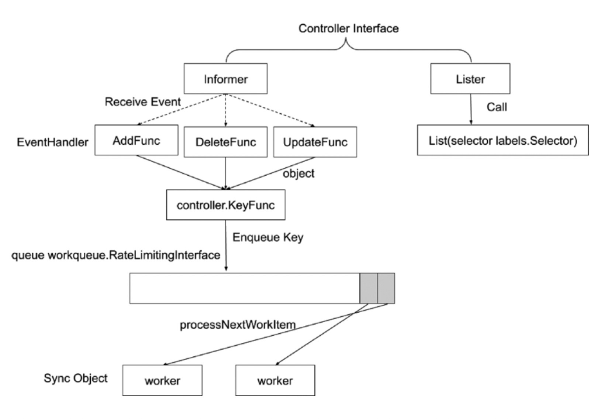
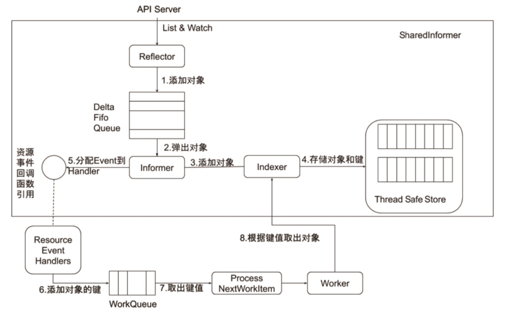
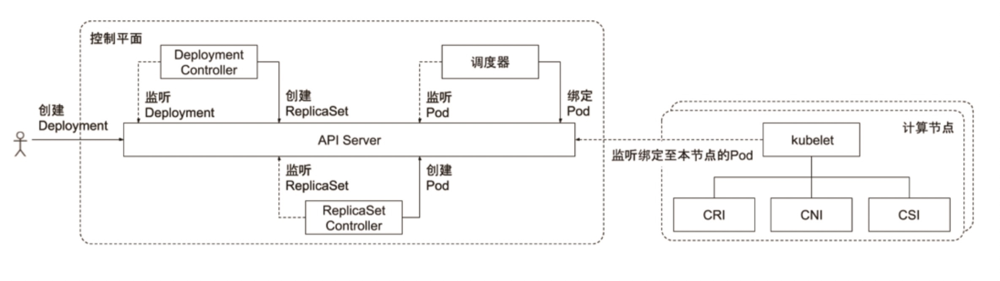
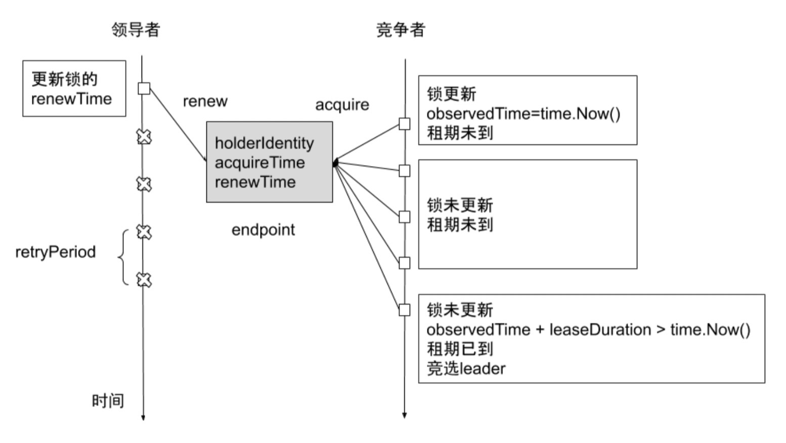

# controller manager

## 工作原理
### 控制器的工作流程

### informer 内部机制

### 控制器协同工作原理

## 通用 controller
> - Job Controller 处理 job
> - Pod AutoScaler 处理 pod 的自动缩容、扩容
> - ReplicaSet 依据 Replicaset Spec 创建 pod
> - Service Controller 为 LoadBalancer type 的 service 创建 LB VIP
> - ServiceAccount Controller 确保 service account 在当前 namespace 存在
> - StatefulSet Controller 处理 statefulset 中的 pod
> - Volume Controller 依据 PV spec 创建 volume
> - Resource quota Controller 在用户使用资源之后，更新状态
> - Namespace Controller 保证 namespace 删除时，该 namespace 下的所有资源都先被删除
> - Replication Controller 创建 RC 后，负责创建 pod
> - Node Controller 维护 node 状态，处理 evict 请求
> - Daemon Controller 依据 damonset 创建 pod
> - Deployment Controller 依据 deployment spec 创建 replicaset
> - Endpoint Controller 依据 service spec 创建 endpoint，根据 podip 更新 endpoint
> - Garbage Controller 处理级联删除，比如删除 deployment 的同时删除 replicaset 以及 pod
> - CronJob Controller 处理 cronjob

## Cloud Controller Manager

> 自 Kubernetes 1.6 开始，从 controller manager 中分离出来，主要因为 Cloud Controller Manager 往往需要跟企业 cloud 做深度集成

> 通常 Cloud Controller Manager 需要
> - 认证授权：企业 Cloud 往往需要认证信息，Kubernetes 要与 Cloud API 通信，需要获取 Cloud 系统里面的 ServiceAccount
> - Cloud Controller Manager：本身作为一个用户态的 component，需要在 Kubernetes 中有正确的 RBAC 设置，获得资源操作权限
> - 高可用：通过 leader election 来确保 Cloud Controller Manager 高可用

> Cloud Controller Manager 配置
> - apiserver 和 controller manager 中一定不能指定 cloud provider，否则会加载内置的 Cloud Controller Manager
> - kubelet 要配置 --cloud-provider=external

> Cloud Controller Manager 主要支持
> - Node Controller：访问 cloud api，来更新 node 状态，在 cloud 删除该节点之后，从 kubernetes 中删除 node
> - Service Controller：负责配置为 loadbalancer 类型的服务配置 LB VIP
> - Route Controller：在 cloud 环境配置路由
> - 可用自定义任何需要的 Cloud Controller

> 保护 controller manager 的 kubeconfig。此 kubeconfig 拥有所有资源的所有操作权限，防止普通用户通过 kubectl exec kube-controller-manager cat