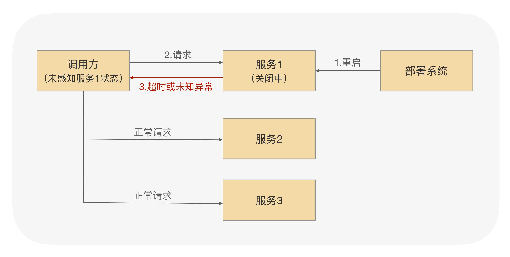
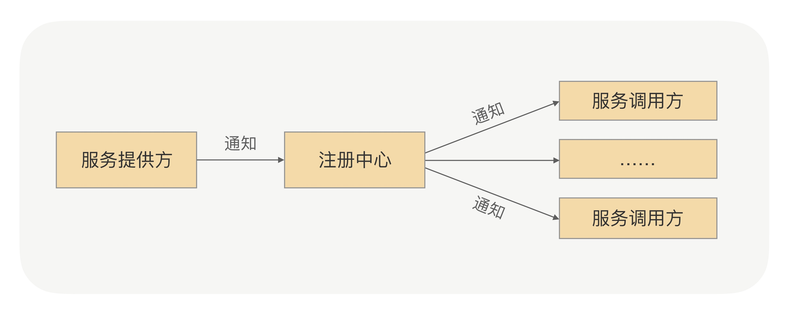
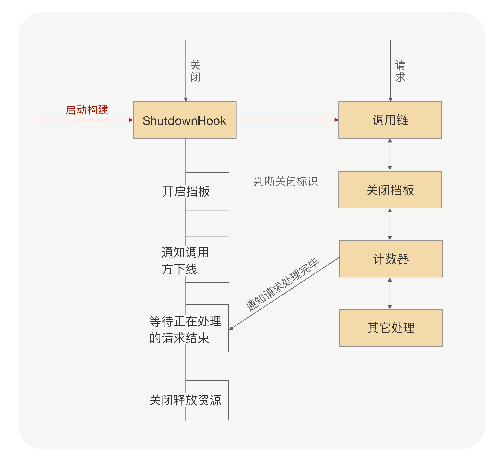

# 优雅关闭

> 在服务重启的时候，对于调用方来说，可能会存在以下几种情况：
> - 调用方发请求前，目标服务已经下线。此时，连接会断开，调用方可以立马感知到，并且在其健康列表里面把这个节点挪掉
> - 调用方发请求的时候，目标服务正在关闭，但调用方并不知道它正在关闭，而且两者之间的连接也没断开，所以这个节点还会存在健康列表里面

## 关闭通知
### 人工通知
> 手动摘除要下线的机器，这种方式很原始也很直接

### 注册中心通知

> 整个关闭过程中依赖了两次 RPC 调用，一次是服务提供方通知注册中心下线操作，一次是注册中心通知服务调用方下线节点操作。注册中心通知服务调用方都是异步的，服务发现只保证最终一致性，并不保证实时性，所以注册中心在收到服务提供方下线的时候，并不能成功保证把这次要下线的节点推送到所有的调用方

### 服务提供方通知
> 在 RPC 里面调用方跟服务提供方之间是长连接，可以在提供方应用内存里面维护一份调用方连接集合，当服务要关闭的时候，挨个去通知调用方去下线这台机器。这样整个调用链路就变短了，对于每个调用方来说就一次 RPC，可以确保调用的成功率很高

### 优雅关闭
> 服务提供方已经开始进入关闭流程，那么很多对象就可能已经被销毁了，关闭后再收到的请求按照正常业务请求来处理，肯定是没法保证能处理的。可以在关闭的时候，设置一个请求挡板：当服务提供方正在关闭，如果这之后还收到了新的业务请求，直接返回一个特定的异常给调用方。调用方收到这个异常响应后，RPC 框架把这个节点从健康列表挪出，并把请求自动重试到其他节点，因为这个请求是没有被服务提供方处理过，所以可以安全地重试到其他节点

> 如果只是靠等待被动调用，就会让这个关闭过程整体有点漫长。因为有的调用方那个时刻没有业务请求，就不能及时地通知调用方了，可以加上主动通知流程，这样既可以保证实时性，也可以避免通知失败的情况

> 捕获关闭事件：通过捕获操作系统的进程信号来获取，java 中通过 Runtime.addShutdownHook 方法注册关闭的钩子。在 RPC 启动的时候，提前注册关闭钩子，并在里面添加了两个处理程序，一个负责开启关闭标识，一个负责安全关闭服务对象

> 引用计数器，每开始处理请求之前加一，完成请求处理减一，通过该计数器我们就可以快速判断是否有正在处理的请求。服务对象在关闭过程中，会拒绝新的请求，同时根据引用计数器等待正在处理的请求全部结束之后才会真正关闭。但考虑到有些业务请求可能处理时间长，或者存在被挂住的情况，为了避免一直等待造成应用无法正常退出，可以在整个 ShutdownHook 里面，加上超时时间控制，当超过了指定时间没有结束，则强制退出应用。超时时间我建议可以设定成 10s

