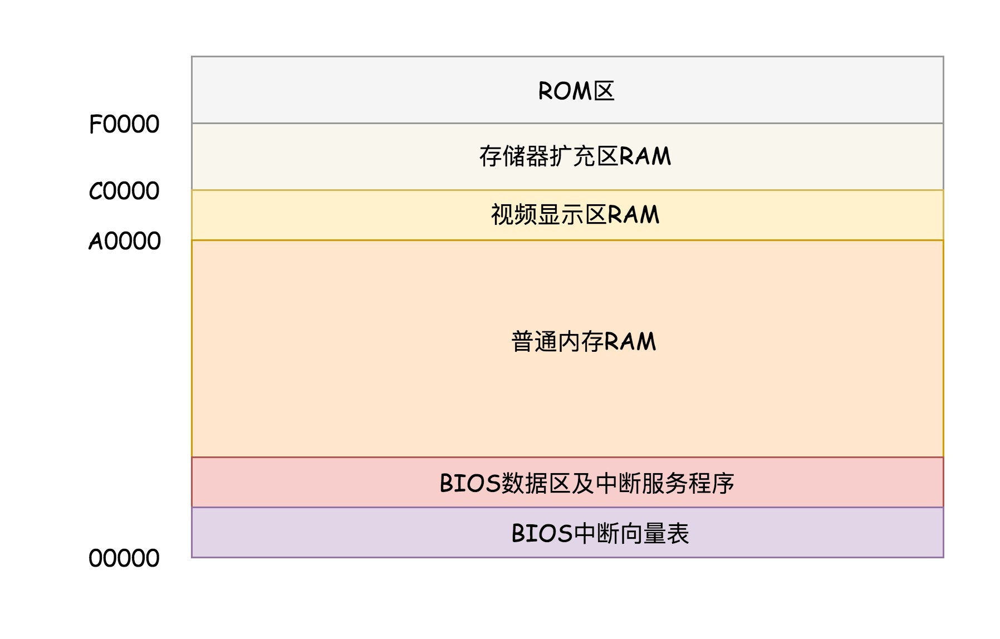
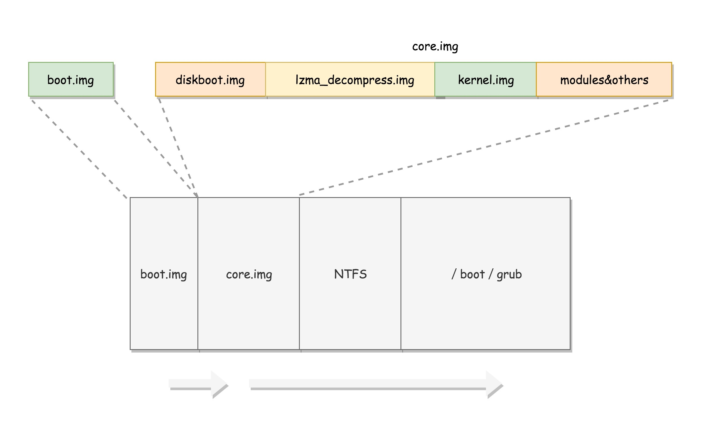

# 启动

## BIOS

> 在 x86 系统中，将 1M 空间最上面的 0xF0000 到 0xFFFFF 这 64K 映射给 ROM，也就是说，到这部分地址访问的时候，会访问 ROM

> 当电脑刚加电的时候，会做一些重置的工作，将 CS 设置为 0xFFFF，将 IP 设置为 0x0000，所以第一条指令就会指向 0xFFFF0，正是在 ROM 的范围内。在这里，有一个 JMP 命令会跳到 ROM 中做初始化工作的代码，于是，BIOS 开始进行初始化的工作

> - 检查系统的硬件
> - 建立一个中断向量表和中断服务程序
> - 在内存空间映射显存的空间，在显示器上显示一些字符

## bootloader

> 在 Linux 里面有一个工具，叫 Grub2，全称 Grand Unified Bootloader Version 2。可以通过 grub2-mkconfig -o /boot/grub2/grub.cfg 来配置系统启动的选项

> 使用 grub2-install /dev/sda，可以将启动程序安装到相应的位置。grub2 第一个要安装的就是 boot.img。它由 boot.S 编译而成，一共 512 字节，正式安装到启动盘的第一个扇区。这个扇区通常称为MBR（Master Boot Record，主引导记录 / 扇区）。BIOS 完成任务后，会将 boot.img 从硬盘加载到内存中的 0x7c00 来运行

> 由于 512 个字节实在有限，boot.img 做不了太多的事情。它能做的最重要的一个事情就是加载 grub2 的另一个镜像 core.img。boot.img 先加载的是 core.img 的第一个扇区。如果从硬盘启动的话，这个扇区里面是 diskboot.img，对应的代码是 diskboot.S。boot.img 将控制权交给 diskboot.img 后，diskboot.img 的任务就是将 core.img 的其他部分加载进来，先是解压缩程序 lzma_decompress.img，再往下是 kernel.img，最后是各个模块 module 对应的映像

> 在这之前，遇到的程序都非常小，完全可以在实模式下运行，但是随着加载的程序越来越大，实模式这 1M 的地址空间实在放不下了，所以在真正的解压缩之前，lzma_decompress.img 做了一个重要的决定，就是调用 real_to_prot，切换到保护模式，这样就能在更大的寻址空间里面，加载更多的东西

## 实模式切换到保护模式

> 启用分段：在内存里面建立段描述符表，将寄存器里面的段寄存器变成段选择子，指向某个段描述符，这样就能实现不同进程的切换了
> 启动分页：能够管理的内存变大了，就需要将内存分成相等大小的块

> 在实模式 8086 下面，一共就 20 个地址线，只能访问 1M 的地址空间。切换保护模式的函数 DATA32 call real_to_prot 会打开 Gate A20，也就是第 21 根地址线的控制线。接下来对压缩过的 kernel.img 进行解压缩，然后跳转到 kernel.img 开始运行

> kernel.img 对应的代码是 startup.S 以及一堆 c 文件，在 startup.S 中会调用 grub_main，这是 grub kernel 的主函数。在这个函数里面，grub_load_config 函数开始解析 grub.conf 文件里的配置信息。如果是正常启动，grub_main 最后会调用 grub_command_execute，最终会调用 grub_normal_execute 函数。在这个函数里面，grub_show_menu 会显示出选择操作系统的列表。一旦启动某个操作系统，就要开始调用 grub_menu_execute_entry，开始解析并执行选择的那一项

> 例如 linux16 命令，表示装载指定的内核文件，并传递内核启动参数。于是 grub_cmd_linux 函数会被调用，它会首先读取 Linux 内核镜像头部的一些数据结构，放到内存中的数据结构来，进行检查。如果检查通过，则会读取整个 Linux 内核镜像到内存。如果配置文件里面还有 initrd 命令，用于为即将启动的内核传递 init ramdisk 路径。于是 grub_cmd_initrd 函数会被调用，将 initramfs 加载到内存中来。当这些事情做完之后，grub_command_execute 才开始真正地启动内核