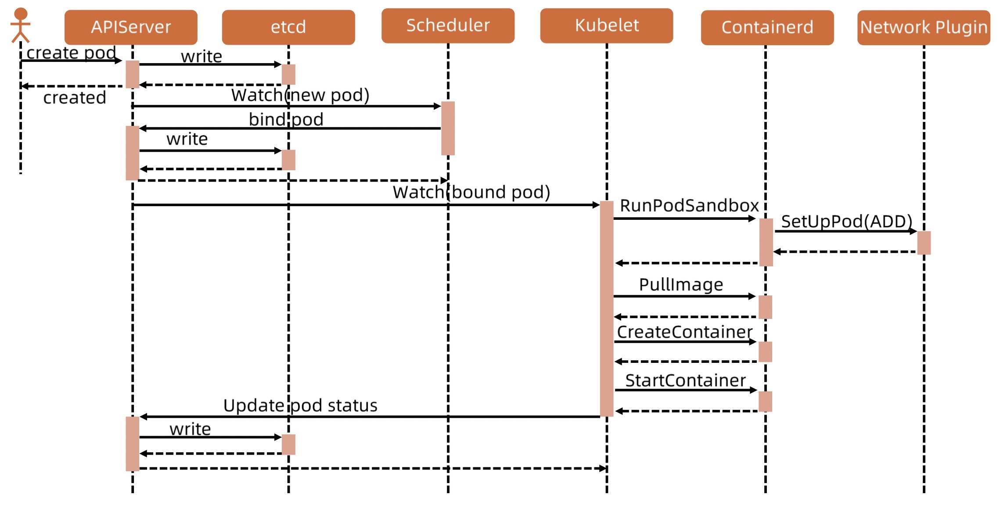

# kubelet

## kubelet 架构

> 每个节点上都运行一个 kubelet 服务进程，默认监听 10250 端口
> 1. 接收并执行 master 发来的指令
> 2. 管理 pod 及 pod 中的容器
> 3. 每个 kubelet 进程会在 api server 上注册节点信息，定期向 master 节点汇报节点的资源使用情况，并通过 cAdvisor 监控节点和容器的资源

### 节点管理

> 节点管理主要是节点注册和节点状态更新
> 1. kubelet 可用通过设置启动参数 --register-node 来确定是否向 api server 注册自己
> 2. 如果 kubelet 没有选择自注册模式，则需要用户自己配置 node 资源信息，同时需要告知 kubelet 集群上的 api server 的位置
> 3. kubelet 在启动时通过 api server 注册节点信息，并定时向 api server 发送节点新消息，api server 在接收到新消息后，将消息写入 etcd

## pod 管理流程

> 获取 pod 清单
> 1. 文件：启动参数 --config 指定的配置目录下的文体，默认 /etc/kubernetes/manifests。该文件每 20 秒重新检查一次（可配置）
> 2. HTTP endpoint：启动参数 --manifest-url 设置。每 20 秒检查一下这个端点（可配置）
> 3. API Server：通过 api server 监听 etcd 目录，同步 pod 清单
> 4. HTTP Server：kubelet 监听 HTTP 请求，并响应简单的 api 以提交新的 pod 清单

