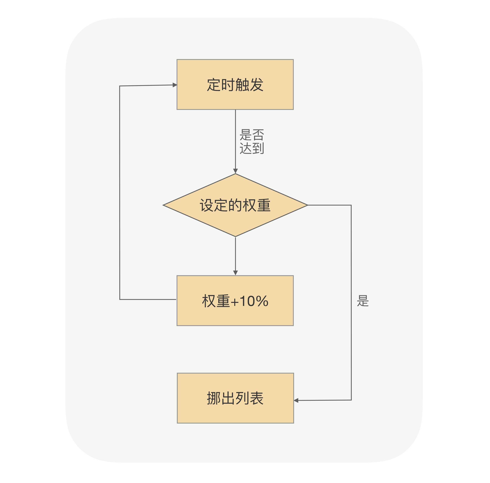
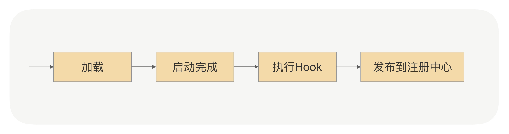

# 优雅启动

## 启动预热

> 让刚启动的服务提供方应用不承担全部的流量，而是让它被调用的次数随着时间的移动慢慢增加，最终让流量缓和地增加到跟已经运行一段时间后的水平一样

> 调用方应用通过服务发现能够获取到服务提供方的 ip 地址，然后每次发送请求前，都需要通过负载均衡算法从连接池中选择一个可用连接。我们可以让负载均衡在选择连接的时候，区分一下是否是刚启动不久的应用。对于刚启动的应用，可以让它被选择到的概率特别低，但这个概率会随着时间的推移慢慢变 大，从而实现一个动态增加流量的过程

> 首先对于调用方来说，需要知道服务提供方启动的时间。一种方法是服务提供方在启动的时候，把自己启动的时间告诉注册中心；另一种方法就是注册中心收到的服务提供方的请求注册时间

## 延迟暴露

> 服务提供方应用在没有启动完成的时候，调用方的请求就过来了，而调用方请求过来的原因是，服务提供方应用在启动过程中把解析到的 RPC 服务注册到了注册中心，这就导致在后续加载没有完成的情况下服务提供方的地址就被服务调用方感知到了

> 把接口注册到注册中心的时间挪到应用启动完成后。具体的做法就是在应用启动加载、解析 Bean 的时候，如果遇到了 RPC 服务的 Bean，只先把这个 Bean 注册到 Spring-BeanFactory 里面去，而并不把这个 Bean 对应的接口注册到注册中心，只有等应用启动完成后，才把接口注册到注册中心用于服务发现，从而实现让服务调用方延迟获取到服务提供方地址

