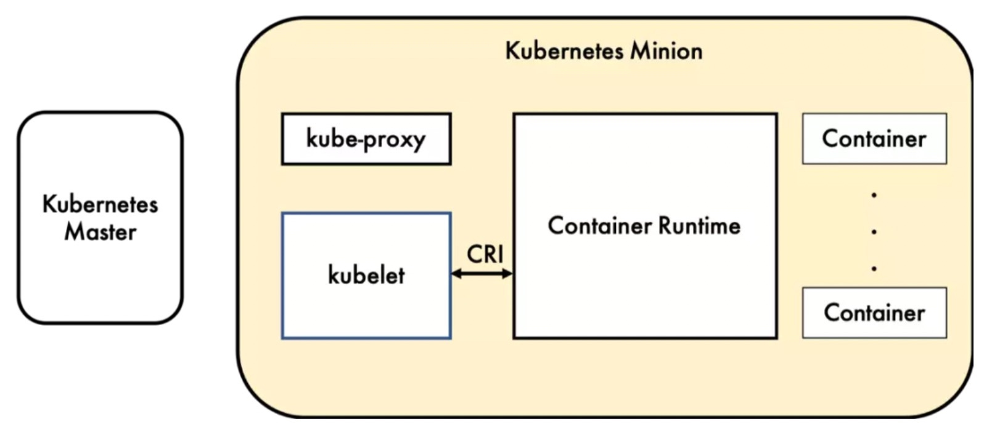
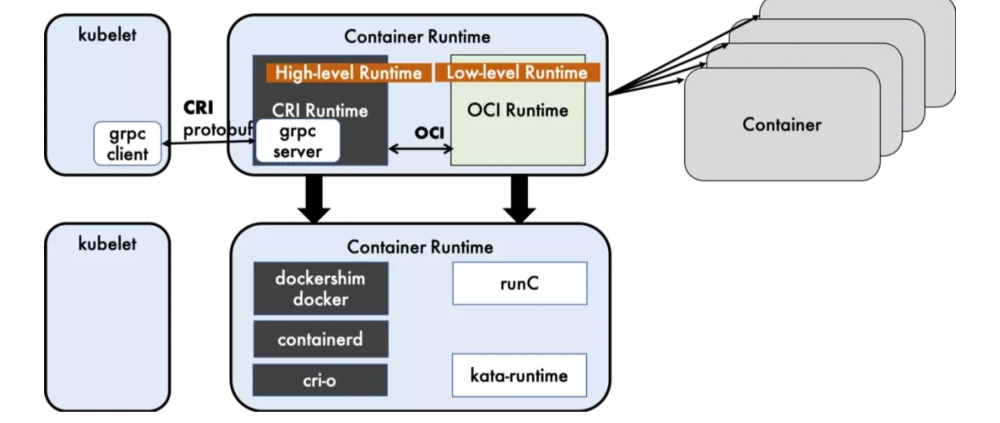
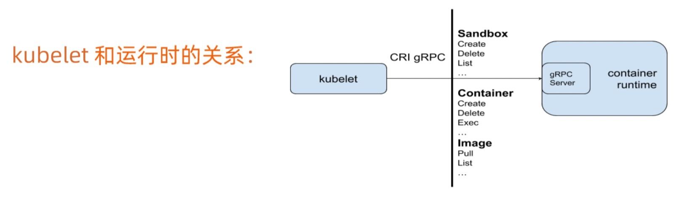
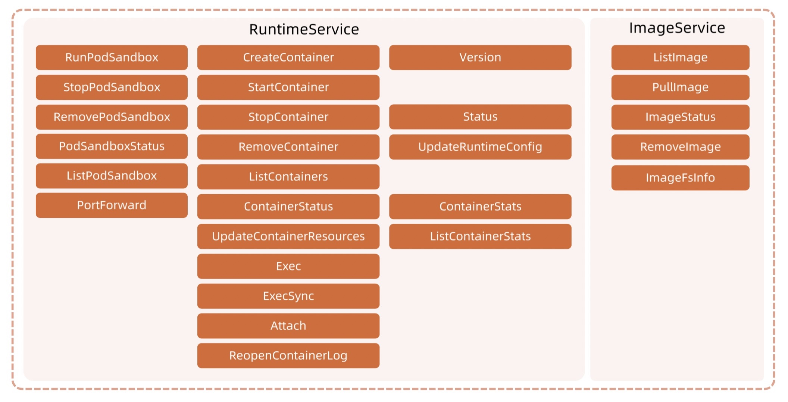
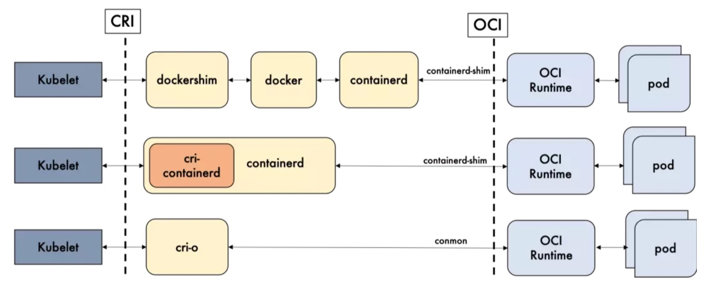
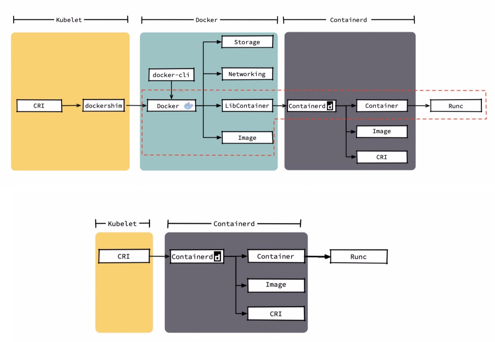
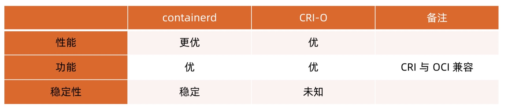

# CRI

> 容器运行时，运行于 kubernetes 集群的每个节点中，负责容器的整个生命周期

## rpc 服务

> CRI 是 kubernetes 定义的一组 gRPC 服务。kubelet 作为客户端，基于 gRPC 框架，通过 socket 和容器运行时通信。CRI 包括两类服务：
> 1. 镜像服务：提供下载、检查和删除镜像的远程程序调用
> 2. 运行时服务：包含用于管理容器生命周期，以及与容器交互的调用的远程程序调用

## 运行时层级

> Dockershim, containerd 和 CRI-O 都是遵循 CRI 的容器运行时，也称为高层级运行时

> OCI（开放容器计划）定义了创建容器的格式和运行时的开源行业标准，包括镜像规范和运行时规范
> 1. 镜像规范定义了 OCI 镜像的标准，高层级运行时将会下载一个 OCI 镜像，并将它解压成 OCI 运行时文件系统包
> 2. 运行时规范描述了如何从 OCI 运行时文件系统包运行容器程序，并且定义它的配置、运行环境和生命周期。如何为新容器设置命名空间和控制组，以及挂载根文件系统等。它的一个参考实现是 runC，我们称其为低层级运行时

> Docker 内部关于容器运行时功能的核心组件是 containerd，后来 containerd 也可直接和 kubelet 通过 CRI 对接，独立在 kubernetes 中使用。相对于 Docker 而言，containerd 减少了 Docker 所需的处理模块 Dockerd 和 Docker-shim，并且对 Docker 支持的存储驱动进行了优化，因此在容器的创建启动停止和删除，以及对镜像的拉取上，都具有性能上的优势

## 运行时比较

