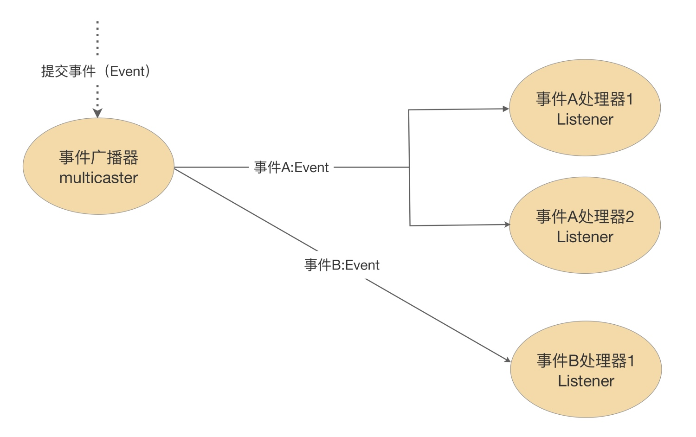

# 事件



## 事件
> 用来区分和定义不同的事件，在 Spring 中，常见的如 ApplicationEvent 和 AutoConfigurationImportEvent，都继承于 java.util.EventObject

## 事件广播器

> 负责发布事件

## 事件监听器

> 负责监听和处理广播器发出的事件，继承于 JDK 的 EventListener

```java
@Order(Ordered.HIGHEST_PRECEDENCE)
public class FooApplicationListener implements ApplicationListener<ContextRefreshedEvent> {
    @Override
    public void onApplicationEvent(ContextRefreshedEvent event) {
        System.out.println("FooApplicationListener listen: " + event.getApplicationContext().getId());
    }
}
```

```properties
# spring.factories
org.springframework.context.ApplicationListener=\
com.pain.flame.blink.listener.FooApplicationListener
```