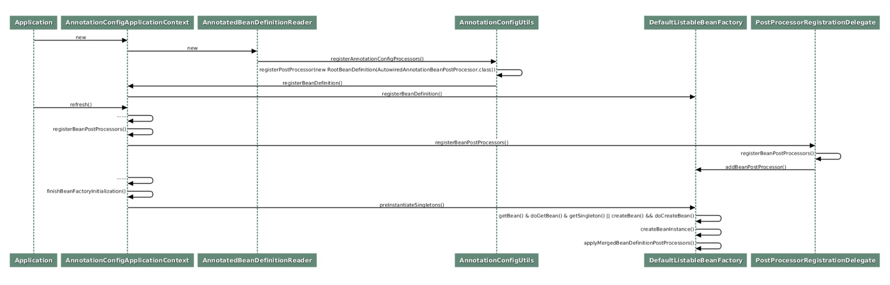

# Bean 生命周期



> 1. 将一些必要的系统类，比如 Bean 的后置处理器类（CommonAnnotationBeanPostProcessor、AutowiredAnnotationBeanPostProcessor），注册到 Spring 容器
> 2. 实例化所有用户定制类，调用后置处理器进行辅助装配、类初始化等

## 初始化
> Spring 初始化单例类的一般过程，基本都是 getBean -> doGetBean -> getSingleton，如果发现 Bean 不存在，则调用 createBean -> doCreateBean 进行实例化

> Bean 初始化的三个关键步骤，分别是 createBeanInstance、populateBean、initializeBean，分别对应实例化 Bean，注入 Bean 依赖，以及初始化 Bean

> 实例化 Bean 的 createBeanInstance 方法通过依次调用 DefaultListableBeanFactory.instantiateBean -> SimpleInstantiationStrategy.instantiate，最终执行到 BeanUtils.instantiateClass。最终将调用 ctor.newInstance 方法实例化用户定制类

```java
@Service
public class MonitorService {

    @Autowired
    private KafkaService kafkaService;

    MonitorService() {
        kafkaService.check();
    }
}

@Slf4j
@Service
public class KafkaService {

    public void check() {
        log.info("check kafka service");
    }
}
```

> 实例化 MonitorService 的时候，负责自动装配的 populateBean 方法还没有被执行，MonitorService 的属性 kafkaService 还是 null，因而会得到空指针异常

```java
@Service
public class MonitorService {

    private KafkaService kafkaService;

    MonitorService(KafkaService kafkaService) {
        this.kafkaService = kafkaService;
        kafkaService.check();
    }
}
```

```
AbstractAutowireCapableBeanFactory#initializeBean
    AbstractAutowireCapableBeanFactory#applyBeanPostProcessorsBeforeInitialization
        * InitDestroyAnnotationBeanPostProcessor#postProcessBeforeInitialization
            InitDestroyAnnotationBeanPostProcessor#findLifecycleMetadata
                LifecycleMetadata#invokeInitMethods
    AbstractAutowireCapableBeanFactory#invokeInitMethods
                InitializingBean#afterPropertiesSet
```

```java
@Service
public class MonitorService implements InitializingBean {

    @Autowired
    private KafkaService kafkaService;

    @PostConstruct
    public void init() {
        kafkaService.check();
    }

    @Override
    public void afterPropertiesSet() throws Exception {
        kafkaService.check();
    }
}
```

## 注销

```
AbstractAutowireCapableBeanFactory#doCreateBean
    AbstractBeanFactory#registerDisposableBeanIfNecessary
        DefaultSingletonBeanRegistry#registerDisposableBean
```

> 当 Spring 容器被销毁时，最终会调用到 DefaultSingletonBeanRegistry#destroySingleton。此方法将遍历 disposableBeans 属性逐一获取 DisposableBean，依次调用其中的 close 或者 shutdown 方法
