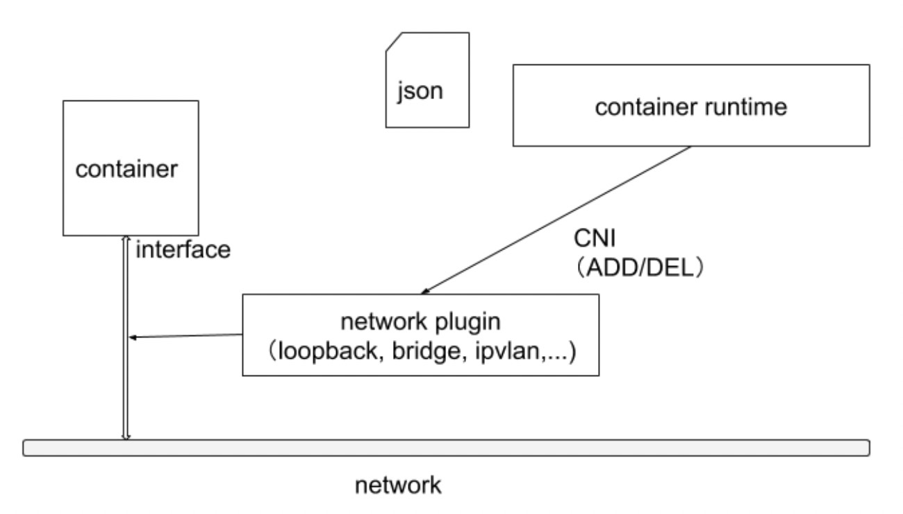
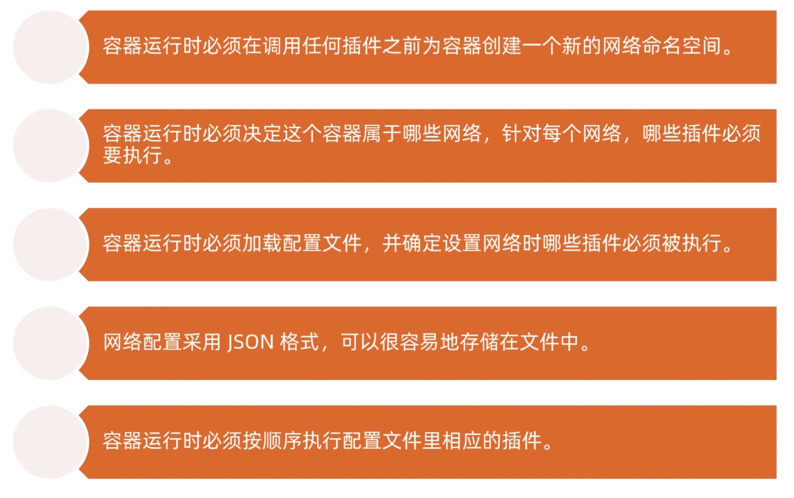
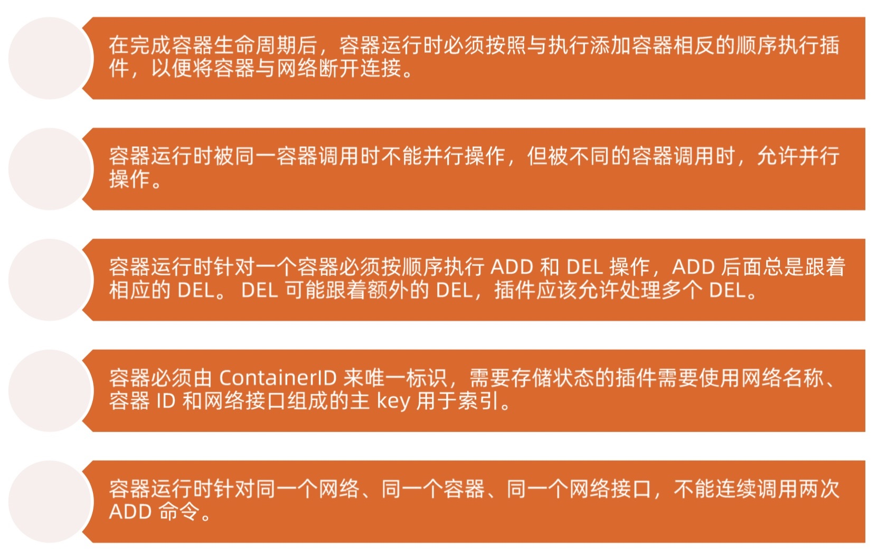
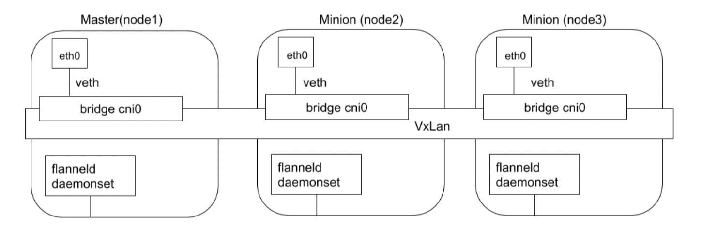
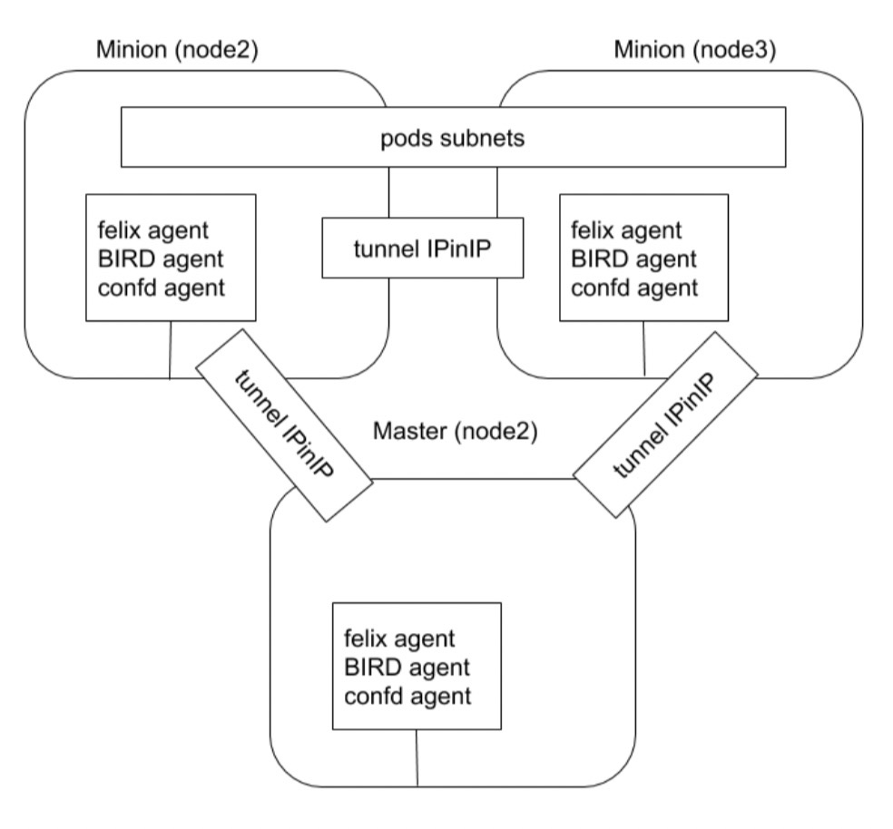
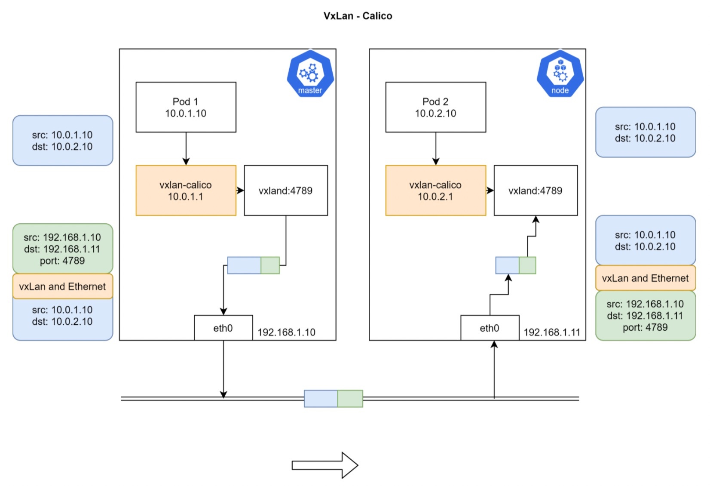
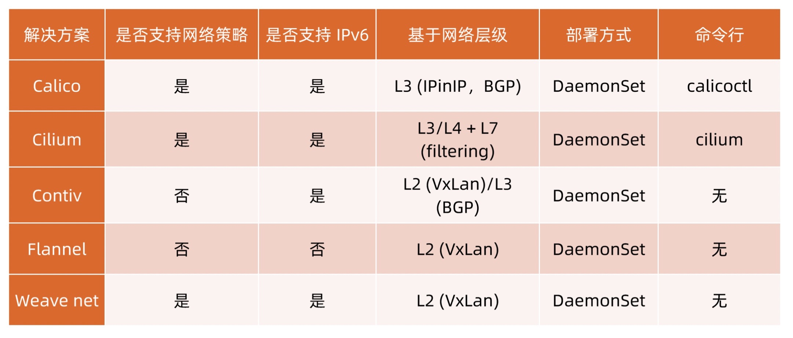

# CNI

> kubernetes 网络模型设计的基础原则：
> 1. 所有的 pod 都能够不通过 nat 就能相互访问
> 2. 所有的节点都能够不通过 nat 就能相互访问
> 3. 容器内看见的 ip 地址和外部组件看到的容器 ip 是一样的

> kubernetes 集群里面，ip 地址是以 pod 为单位进行分配的，每个 pod 都拥有一个独立的 ip 地址。一个 pod 内部的所有容器共享一个网络栈

> kubernetes 提供了一个轻量的通用容器网络接口 CNI，专门用于设置和删除容器的网络连通性。容器运行时通过 CNI 调用网络插件来完成容器的网络设置

> 容器运行时在启动时会从 CNI 的配置目录中读取 json 格式的配置文件，文件后缀为 .conf、.conflist、.json。如果配置目录包括多个文件，一般情况下，会以名字排序选用第一个配置文件作为默认的网络配置，并加载获取其中指定的 CNI 插件名称和配置参数

> 容器运行时一般配置两个参数 --cni-bin-dir 和 --cni-conf-dir。如果是 kubelet 内置的 Docker 作为容器运行时，是由 kubelet 来查找 CNI 插件的，运行插件来为容器设置网络，这两个参数应该配置在 kubelet 处：
> 1. cni-bin-dir：网络插件的可执行文件所在目录，默认是 /opt/cni/bin
> 2. cni-conf-dir：网络插件的配置文件所在目录，默认是 /etc/cni/net.d

## Flannel

> Flannel 使用 kubernetes 集群的现有 etcd 集群来存储状态信息，从而不必提供专用的数据存储，只需要在每个节点上运行 flanneld 来守护进程。

> 每个节点被分配一个子网，为该节点上的 pod 分配 ip 地址。同一主机内的 pod 可以使用网桥进行通信，而不同主机上的 pod 将通过 flanneld 把流量封装在 udp 数据包中，以路由到适当的目的地

> 封装方式默认和推荐的方法是使用 VxLAN，因为它具有良好的性能，并且比其他选项要少些人为干预。虽然使用 VxLAN 之类的技术封装的解决方案效果很好，但缺点就是该过程使流量跟踪变得困难

## Calico

> 对于同网段通信，Calico 使用 BGP 路由协议在主机之间路由数据包，使用 BGP 路由协议也意味着数据包在主机之间移动时不需要包装在额外的封装层中

> 对于跨网段通信，基于 IPinIP 使用虚拟网卡设备 tunl0，用一个 ip 数据包封装另外一个 ip 数据包，外层 ip 数据包头的源地址为隧道入口设备的 ip 地址，目标地址为隧道出口设备的 ip 地址

### Calico 组件

### Calico VXLan

## CNI 插件对比

