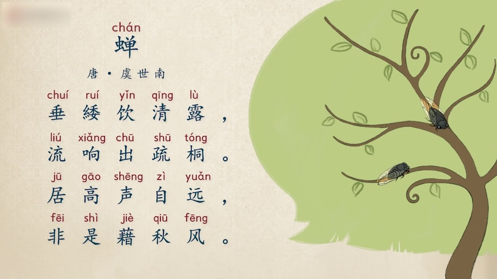

# 虞世南

虞世南，字伯施，越州余姚县（今浙江省-宁波-慈溪市）人，南北朝至隋唐时期书法家、诗人。他的父亲时南北朝时期，陈朝太子中庶子虞荔。隋灭南陈之后，他跟随自己的兄长一起来到了大兴城。当时兄弟二人都名重一时，晋王的杨广征召他，到了隋炀帝的大业年间，虞世南接连被授为秘书郎，升迁为起居舍

大业 14 年，宇文化及发动了江都兵变，缢杀了隋炀帝。之后，宇文化及带领隋朝的骁果军北上，虞世南也被裹挟其中。后来宇文化及兵败被杀，虞世南被河北的窦建德抓获，窦建德赏识他的才能，授予他黄门侍郎官位。再后来，秦王李世民东征，消灭了窦建德后，虞世南被授任为秦王府参军、记室参军、弘文馆学士，与房玄龄等共掌文翰，成为“十八学士”之一。贞观十二年（638年），虞世南去世，享年八十一岁

虞世南善书法，与欧阳询、褚遂良、薛稷合称“初唐四大家”（日本学界称欧阳询、褚遂良、虞世南为“初唐三大家”）。所编的《北堂书钞》，为唐代四大类书之一，是中国现存最早的类书之一。原有诗文集三十卷，已散失不全。民国张寿镛辑成《虞秘监集》 四卷

江都之变时，宇文化及反叛杀君，虞世南之兄虞世基任内史侍郎，也将被杀，虞世南抱持着虞世基痛号悲泣，请求让自己替兄受死，宇文化及不同意 [65]  ，虞世南因此悲哀得瘦损异常，形销骨立，时人因而都称赞他