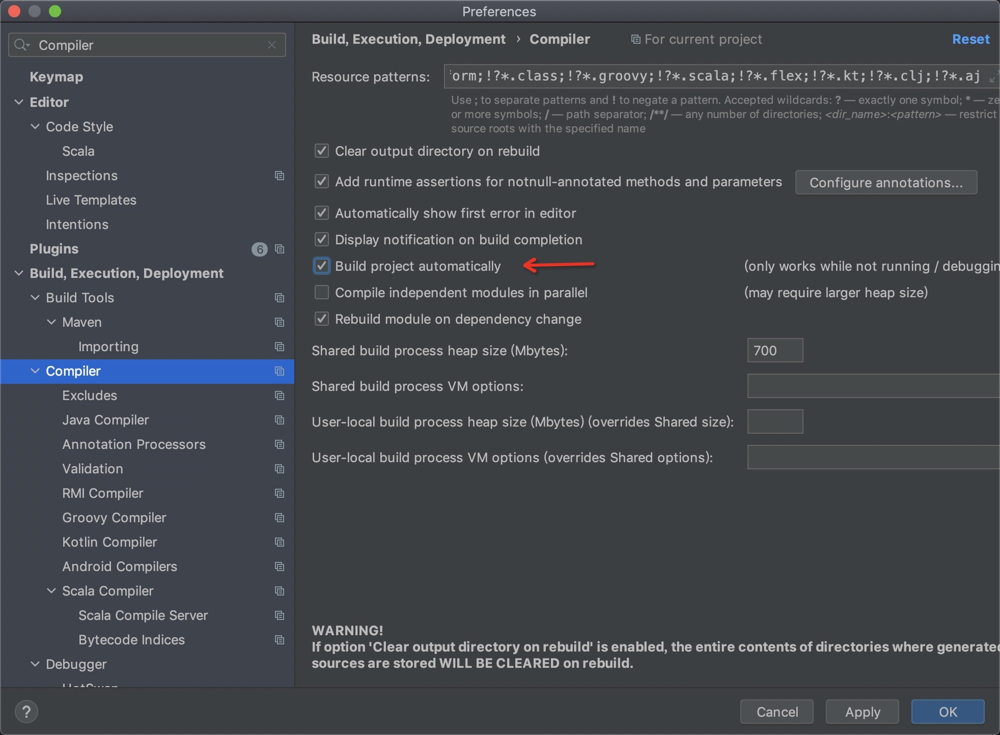
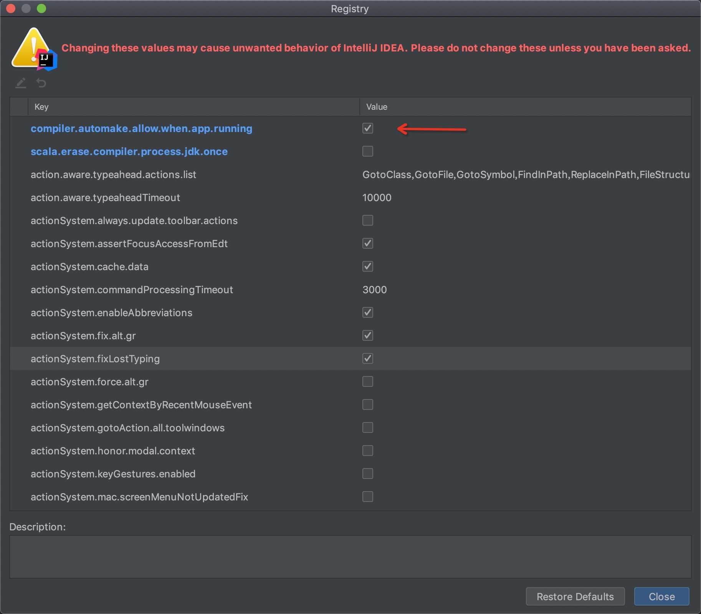

# 热部署

> 引入依赖

```xml
<dependency>
  <groupId>org.springframework.boot</groupId>
  <artifactId>spring-boot-devtools</artifactId>
  <scope>runtime</scope>
  <optional>true</optional>
</dependency>
```

> 开启静态自动编译



> 开启动态自动编译
> Find Actions


