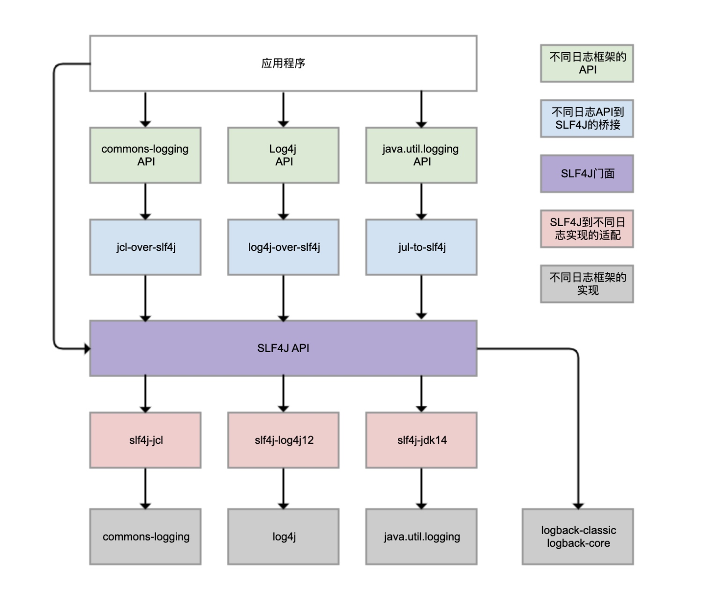

# 日志



## SLF4J 功能
> 1. 提供了统一的日志门面 API，即图中紫色部分，实现了中立的日志记录 API
> 2. 桥接功能，即图中蓝色部分，用来把各种日志框架的 API 桥接到 SLF4J API。这样，即便程序中使用了各种日志 API 记录日志，最终都可以桥接到 SLF4J 门面 API
> 3. 适配功能，即图中红色部分，可以实现 SLF4J API 和实际日志框架的绑定。SLF4J 只是日志标准，还需要一个实际的日志框架。日志框架本身没有实现 SLF4J API，所以需要有一个前置转换。Logback 就是按照 SLF4J API 标准实现的，因此不需要绑定模块做转换

> 虽然可以使用 log4j-over-slf4j 来实现 Log4j 桥接到 SLF4J，也可以使用 slf4j-log4j12 实现 SLF4J 适配到 Log4j，但是不能同时使用它们，否则就会产生死循环。jcl 和 jul 也是同样的道理

## 日志统一
> 1. 将系统中其他日志框架排除出去（commons-logging, log4j，jul）
> 2. 用中间包代替原来的日志框架 （jcl-over-slf4j, log4j-over-slf4j, jul-to-slf4j）
> 3. 导入 slf4j 的其他实现（logback）

> 如果代码或使用的某些库直接使用 Log4j，但你想使用与 Log4j 不同的 SLF4J 绑定，请加入 log4j-over-slf4j，并删除 Log4j 库。它将对 SLF4J 的 Log4j API 调用路由到你选择的绑定

> 如果想对 SLF4J 使用 Log4j1.2 绑定，请加入 slf4j-log4j12

> log4j-over-slf4j 与 slf4j-log4j12 不能同时存在

## 日志重复
### 继承关系导致

```xml
<?xml version="1.0" encoding="UTF-8" ?>
<configuration>
    <appender name="CONSOLE" class="ch.qos.logback.core.ConsoleAppender">
        <layout class="ch.qos.logback.classic.PatternLayout">
            <pattern>[%d{yyyy-MM-dd HH:mm:ss.SSS}] [%thread] [%-5level] [%logger{40}:%line] - %msg%n</pattern>
        </layout>
    </appender>
    <logger name="com.pain.flame.green" level="DEBUG">
        <appender-ref ref="CONSOLE"/>
    </logger>
    <root level="INFO">
        <appender-ref ref="CONSOLE"/>
    </root>
</configuration>
```

> CONSOLE 这个 Appender 同时挂载到了两个 Logger 上，同一条日志既会通过 logger 记录，也会发送到 root 记录，因此应用 package 下的日志出现了重复记录

> 如果只是为了让应用内的日志暂时开启 DEBUG 级别的日志记录，完全不需要重复挂载 Appender

```xml
<?xml version="1.0" encoding="UTF-8" ?>
<configuration>
    <appender name="CONSOLE" class="ch.qos.logback.core.ConsoleAppender">
        <layout class="ch.qos.logback.classic.PatternLayout">
            <pattern>[%d{yyyy-MM-dd HH:mm:ss.SSS}] [%thread] [%-5level] [%logger{40}:%line] - %msg%n</pattern>
        </layout>
    </appender>
    <logger name="com.pain.flame.green" level="DEBUG"/>
    <root level="INFO">
        <appender-ref ref="CONSOLE"/>
    </root>
</configuration>
```

> 如果自定义的需要把日志输出到不同的 Appender，比如将应用的日志输出到文件 app.log、把其他框架的日志输出到控制台，可以设置的 additivity 属性为 false

```xml
<?xml version="1.0" encoding="UTF-8" ?>
<configuration>
    <appender name="FILE" class="ch.qos.logback.core.FileAppender">
        <file>app.log</file>
        <encoder class="ch.qos.logback.classic.encoder.PatternLayoutEncoder">
            <pattern>[%d{yyyy-MM-dd HH:mm:ss.SSS}] [%thread] [%-5level] [%logger{40}:%line] - %msg%n</pattern>
        </encoder>
    </appender>
    <appender name="CONSOLE" class="ch.qos.logback.core.ConsoleAppender">
      <layout class="ch.qos.logback.classic.PatternLayout">
            <pattern>[%d{yyyy-MM-dd HH:mm:ss.SSS}] [%thread] [%-5level] [%logger{40}:%line] - %msg%n</pattern>
      </layout>
	  </appender>
    <logger name="com.pain.flame.green" level="DEBUG" additivity="false">
        <appender-ref ref="FILE" />
    </logger>
	  <root level="INFO">
		  <appender-ref ref="CONSOLE" />
	  </root>
</configuration>
```

### LevelFilter 导致

```xml
<?xml version="1.0" encoding="UTF-8" ?>
<configuration>
	<property name="logDir" value="./logs" />
	<property name="app.name" value="flame" />

	<appender name="CONSOLE" class="ch.qos.logback.core.ConsoleAppender">
		<layout class="ch.qos.logback.classic.PatternLayout">
			<pattern>[%d{yyyy-MM-dd HH:mm:ss.SSS}] [%thread] [%-5level] [%logger{40}:%line] - %msg%n</pattern>
		</layout>
	</appender>

	<appender name="INFO_FILE" class="ch.qos.logback.core.FileAppender">
		<File>${logDir}/${app.name}_info.log</File>
		<filter class="ch.qos.logback.classic.filter.LevelFilter">
			<level>INFO</level>
		</filter>
		<encoder class="ch.qos.logback.classic.encoder.PatternLayoutEncoder">
			<pattern>[%d{yyyy-MM-dd HH:mm:ss.SSS}] [%thread] [%-5level] [%logger{40}:%line] - %msg%n</pattern>
			<charset>UTF-8</charset>
		</encoder>
	</appender>

	<appender name="ERROR_FILE" class="ch.qos.logback.core.FileAppender">
		<File>${logDir}/${app.name}_error.log</File>
		<filter class="ch.qos.logback.classic.filter.ThresholdFilter">
			<level>WARN</level>
		</filter>
		<encoder class="ch.qos.logback.classic.encoder.PatternLayoutEncoder">
			<pattern>[%d{yyyy-MM-dd HH:mm:ss.SSS}] [%thread] [%-5level] [%logger{40}:%line] - %msg%n</pattern>
			<charset>UTF-8</charset>
		</encoder>
	</appender>

	<root level="INFO">
		<appender-ref ref="CONSOLE" />
		<appender-ref ref="INFO_FILE"/>
		<appender-ref ref="ERROR_FILE"/>
	</root>
</configuration>
```

> info.log 中包含了 INFO、WARN 和 ERROR 三个级别的日志，不符合预期

> ThresholdFilter 过滤日志时，当日志级别大于等于配置的级别时返回 NEUTRAL，继续调用过滤器链上的下一个过滤器；否则，返回 DENY 直接拒绝记录日志

> LevelFilter 用来比较日志级别，如果匹配就调用 onMatch 定义的处理方式，默认是交给下一个过滤器处理；否则，调用 onMismatch 定义的处理方式，默认也是交给下一个过滤器处理。LevelFilter 仅仅配置 level 是无法真正起作用的。由于没有配置 onMatch 和 onMismatch 属性，所以相当于这个过滤器是无用的，导致 INFO 以上级别的日志都记录了

> 配置 LevelFilter 的 onMatch 属性为 ACCEPT，表示接收 INFO 级别的日志；配置 onMismatch 属性为 DENY，表示除了 INFO 级别都不记录

```xml
<?xml version="1.0" encoding="UTF-8" ?>
<configuration>
	<property name="logDir" value="./logs" />
	<property name="app.name" value="flame" />

	<appender name="CONSOLE" class="ch.qos.logback.core.ConsoleAppender">
		<layout class="ch.qos.logback.classic.PatternLayout">
			<pattern>[%d{yyyy-MM-dd HH:mm:ss.SSS}] [%thread] [%-5level] [%logger{40}:%line] - %msg%n</pattern>
		</layout>
	</appender>

	<appender name="INFO_FILE" class="ch.qos.logback.core.FileAppender">
		<File>${logDir}/${app.name}_info.log</File>
		<filter class="ch.qos.logback.classic.filter.LevelFilter">
			<level>INFO</level>
			<onMatch>ACCEPT</onMatch>
			<onMismatch>DENY</onMismatch>
		</filter>
		<encoder class="ch.qos.logback.classic.encoder.PatternLayoutEncoder">
			<pattern>[%d{yyyy-MM-dd HH:mm:ss.SSS}] [%thread] [%-5level] [%logger{40}:%line] - %msg%n</pattern>
			<charset>UTF-8</charset>
		</encoder>
	</appender>

	<appender name="ERROR_FILE" class="ch.qos.logback.core.FileAppender">
		<File>${logDir}/${app.name}_error.log</File>
		<filter class="ch.qos.logback.classic.filter.ThresholdFilter">
			<level>WARN</level>
		</filter>
		<encoder class="ch.qos.logback.classic.encoder.PatternLayoutEncoder">
			<pattern>[%d{yyyy-MM-dd HH:mm:ss.SSS}] [%thread] [%-5level] [%logger{40}:%line] - %msg%n</pattern>
			<charset>UTF-8</charset>
		</encoder>
	</appender>

	<root level="INFO">
		<appender-ref ref="CONSOLE" />
		<appender-ref ref="INFO_FILE"/>
		<appender-ref ref="ERROR_FILE"/>
	</root>

</configuration>
```

## 异步日志
### 同步

```xml
<?xml version="1.0" encoding="UTF-8" ?>
<configuration>
    <appender name="FILE" class="ch.qos.logback.core.FileAppender">
        <file>app.log</file>
        <encoder class="ch.qos.logback.classic.encoder.PatternLayoutEncoder">
            <pattern>[%d{yyyy-MM-dd HH:mm:ss.SSS}] [%thread] [%-5level] [%logger{40}:%line] - %msg%n</pattern>
        </encoder>
    </appender>

    <appender name="CONSOLE" class="ch.qos.logback.core.ConsoleAppender">
        <layout class="ch.qos.logback.classic.PatternLayout">
            <pattern>[%d{yyyy-MM-dd HH:mm:ss.SSS}] [%thread] [%-5level] [%logger{40}:%line] - %msg%n</pattern>
        </layout>
        <filter class="ch.qos.logback.core.filter.EvaluatorFilter">
            <evaluator class="ch.qos.logback.classic.boolex.OnMarkerEvaluator">
                <marker>time</marker>
            </evaluator>
            <onMismatch>DENY</onMismatch>
            <onMatch>ACCEPT</onMatch>
        </filter>
    </appender>

    <root level="INFO">
        <appender-ref ref="FILE"/>
        <appender-ref ref="CONSOLE"/>
    </root>
</configuration>
```

```java
long begin = System.currentTimeMillis();
String payload = IntStream.rangeClosed(1, 1000000)
    .mapToObj(__ -> "a")
    .collect(Collectors.joining("")) + UUID.randomUUID().toString();
IntStream.rangeClosed(1, count)
    .forEach(i -> log.info("{} {}", i, payload));
Marker timeMarker = MarkerFactory.getMarker("time");
log.info(timeMarker, "took {} ms", System.currentTimeMillis() - begin);
```

### 异步

```xml
<?xml version="1.0" encoding="UTF-8" ?>
<configuration>
    <appender name="FILE" class="ch.qos.logback.core.FileAppender">
        <file>app.log</file>
        <encoder class="ch.qos.logback.classic.encoder.PatternLayoutEncoder">
            <pattern>[%d{yyyy-MM-dd HH:mm:ss.SSS}] [%thread] [%-5level] [%logger{40}:%line] - %msg%n</pattern>
        </encoder>
    </appender>
    <appender name="CONSOLE" class="ch.qos.logback.core.ConsoleAppender">
        <layout class="ch.qos.logback.classic.PatternLayout">
            <pattern>[%d{yyyy-MM-dd HH:mm:ss.SSS}] [%thread] [%-5level] [%logger{40}:%line] - %msg%n</pattern>
        </layout>
        <filter class="ch.qos.logback.core.filter.EvaluatorFilter">
            <evaluator class="ch.qos.logback.classic.boolex.OnMarkerEvaluator">
                <marker>time</marker>
            </evaluator>
            <onMismatch>DENY</onMismatch>
            <onMatch>ACCEPT</onMatch>
        </filter>
    </appender>
    <appender name="ASYNCFILE" class="ch.qos.logback.classic.AsyncAppender">
        <appender-ref ref="FILE"/>
    </appender>
    <root level="INFO">
        <appender-ref ref="ASYNCFILE"/>
        <appender-ref ref="CONSOLE"/>
    </root>
</configuration>
```

> AsyncAppender 参数配置：
> 1. includeCallerData 用于控制是否收集调用方数据，默认是 false，此时方法行号、方法 名等信息将不能显示
> 2. queueSize 用于控制阻塞队列大小，使用的 ArrayBlockingQueue 阻塞队列，默认大小是 256，即内存中最多保存 256 条日志
> 3. discardingThreshold 是控制丢弃日志的阈值，主要是防止队列满后阻塞。默认情况下，队列剩余量低于队列长度的 20%，就会丢弃 TRACE、DEBUG 和 INFO 级别的日志
> 4. neverBlock 用于控制队列满的时候，加入的数据是否直接丢弃，不会阻塞等待，默认是 false

> queueSize 设置得特别大，就可能会导致 OOM。queueSize 设置得比较小，且 discardingThreshold 设置为大于 0 的值，队列剩余容量少于 discardingThreshold 的配置就会丢弃 <=INFO 的日志
