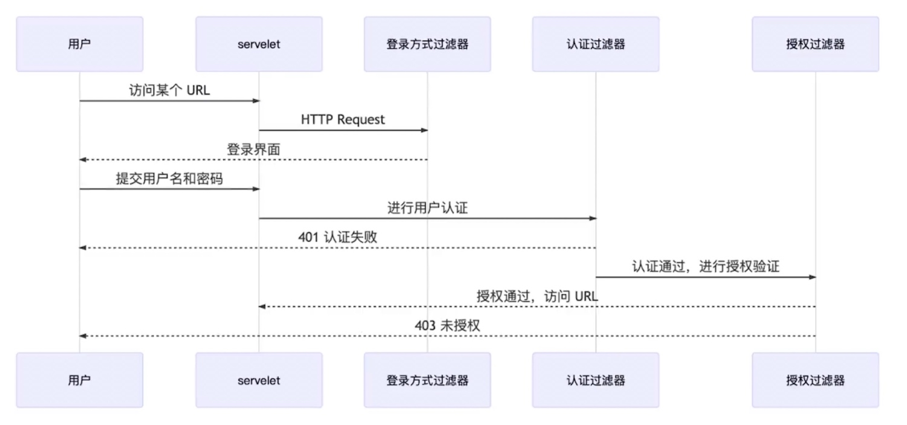

# 过滤器

## 过滤器链

## 过滤器
### 内置过滤器
#### BasicAuthenticationFilter
> 如果在请求中找到一个 Basic Auth HTTP 头，则尝试用该头中的用户名和密码验证用户

#### UsernamePasswordAuthenticationFilter
> 如果在请求参数或者 POST 的 Request Body 中找到用户名/密码，则尝试用这些值对用户进行身份验证

#### DefaultLoginPageGeneratingFilter
> 默认登录页面生成过滤器。用于生成一个登录页面，如果没有明确禁用这个功能，那么就会生成一个登录页面

#### DefaultLogoutPageGeneratingFilter
> 如果没有禁用该功能，则会生成一个注销页面

#### FilterSecurityInterceptor
> 过滤安全拦截器，用于授权逻辑
