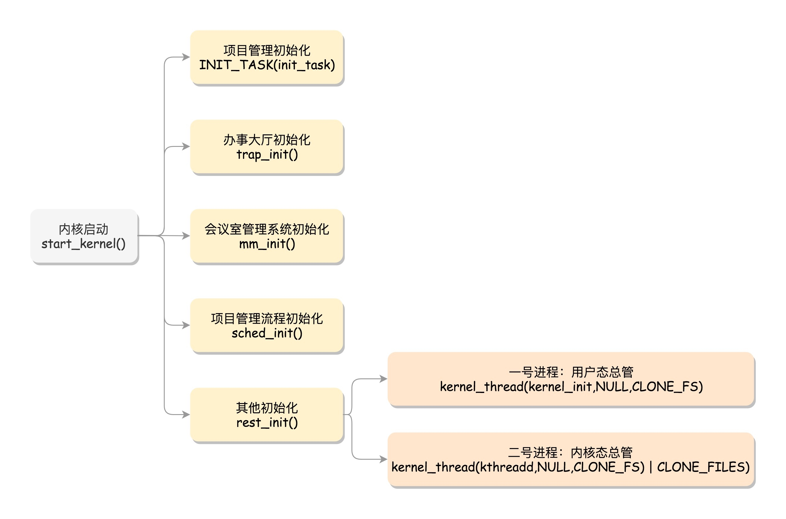
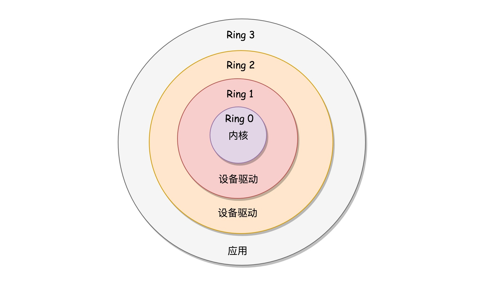
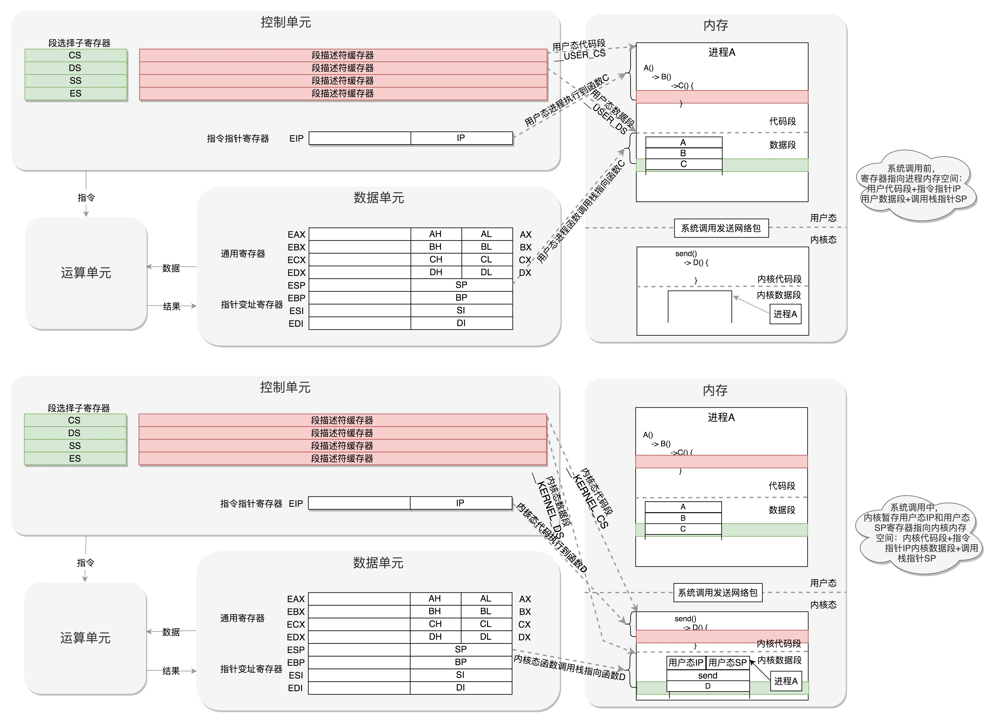
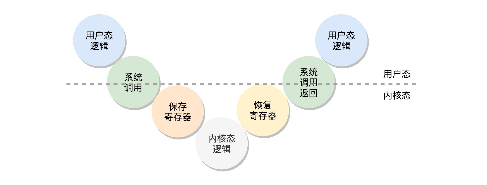

# 内核初始化

> 内核的启动从入口函数 start_kernel() 开始。在 init/main.c 文件中，start_kernel 相当于内核的 main 函数

## init_task
> 系统创建第一个进程，称为 0 号进程。这是唯一一个没有通过 fork 或者 kernel_thread 产生的进程

## trap_init
> trap_init() 函数设置了很多中断门，用于处理各种中断。其中有一个 set_system_intr_gate(IA32_SYSCALL_VECTOR, entry_INT80_32)，这是系统调用的中断门。系统调用也是通过发送中断的方式进行的

## mm_init
> mm_init() 用来初始化内存管理模块

## sched_init
> sched_init() 用于初始化调度模块

## vfs_caches_init
> vfs_caches_init() 用来初始化基于内存的文件系统 rootfs。为了兼容各种各样的文件系统，需要将文件的相关数据结构和操作抽象出来，形成一个抽象层对上提供统一的接口，这个抽象层就是 VFS(Virtual File System)，虚拟文件系统

## rest_init
> start_kernel() 最后调用的是 rest_init()，用来做其他方面的初始化

### 初始化 1 号进程
> rest_init 用 kernel_thread(kernel_init, NULL, CLONE_FS) 创建第二个进程，也就是 1 号进程。1 号进程对于操作系统来讲，有划时代的意义，因为它将运行一个用户进程

> x86 提供了分层的权限机制，把区域分成了四个 Ring，越往里权限越高，越往外权限越低。操作系统利用这个机制，将能够访问关键资源的代码放在 Ring0，称为内核态；将普通的程序代码放在 Ring3，称为用户态

> 当一个用户态的程序运行到一半，要访问一个核心资源，例如访问网卡发一个网络包，就需要暂停当前的运行，调用系统调用，接下来就轮到内核中的代码运行了。首先，内核将从系统调用传过来的包，在网卡上排队，轮到的时候就发送。发送完了，系统调用就结束了，返回用户态，让暂停运行的程序接着运行

### 创建 2 号进程
> kernel_thread(kthreadd, NULL, CLONE_FS | CLONE_FILES) 又一次使用 kernel_thread 函数创建进程。这里的函数 kthreadd，负责所有内核态的线程的调度和管理，是内核态所有线程运行的祖先