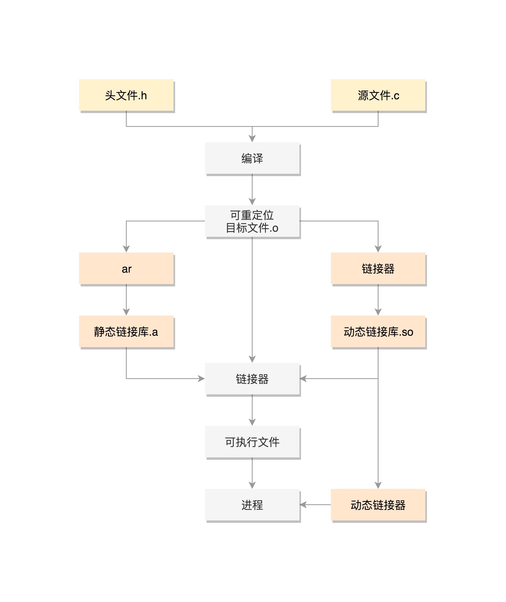
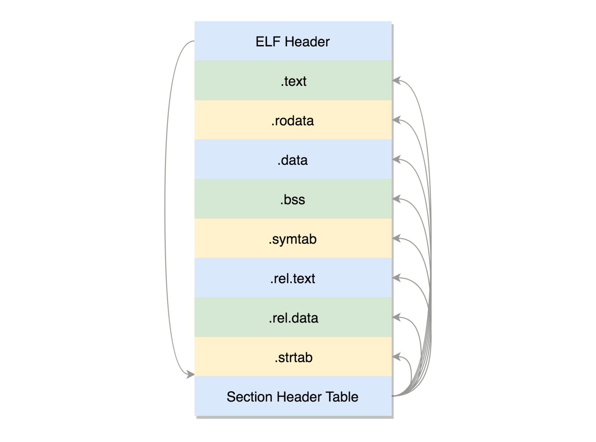
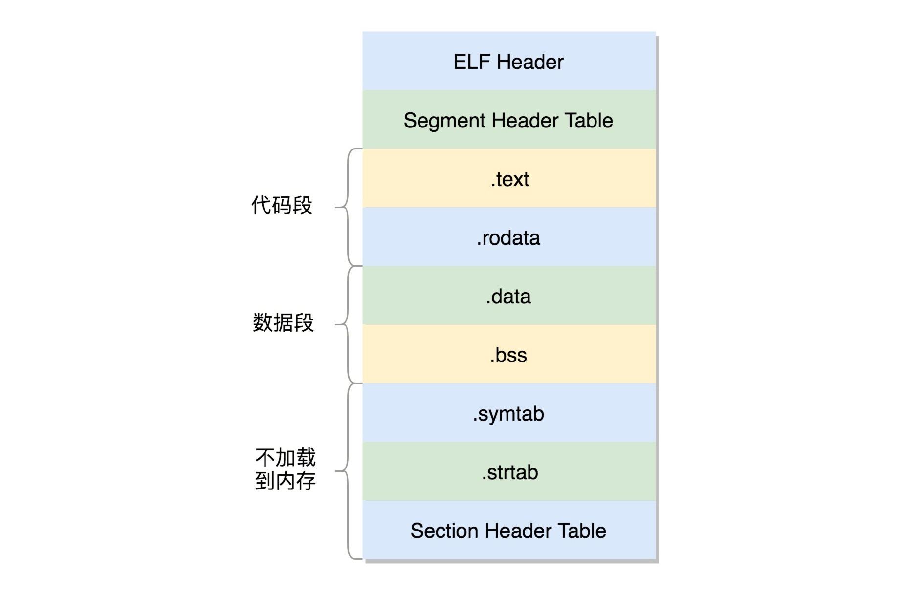
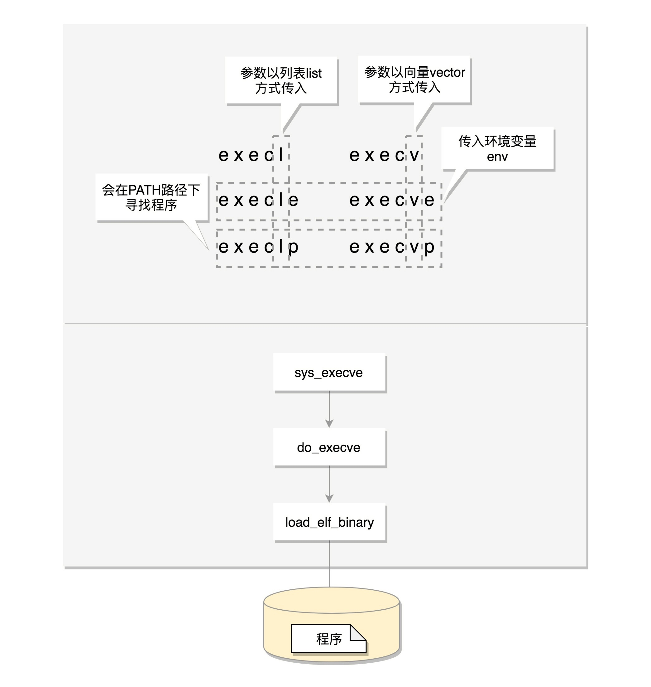
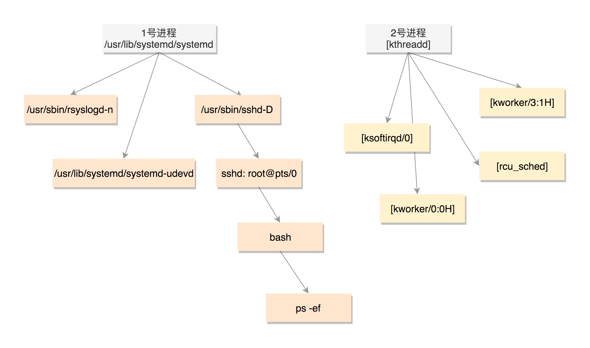
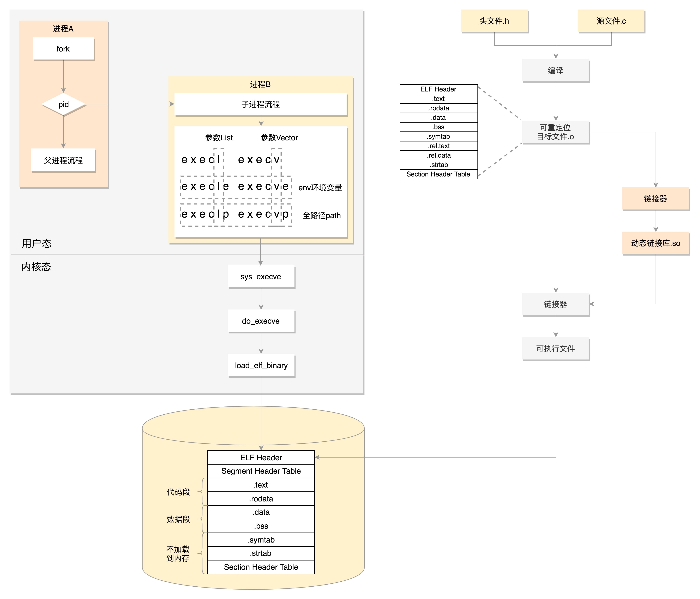

# 二进制程序

```c
#include <stdio.h>
#include <stdlib.h>
#include <sys/types.h>
#include <unistd.h>

extern int create_process (char* program, char** arg_list);

int create_process (char* program, char** arg_list)
{
    pid_t child_pid;
    child_pid = fork();
    if (child_pid != 0)
        return child_pid;
    else {
        execvp (program, arg_list);
        abort ();
    }
}
```

```c
#include <stdio.h>
#include <stdlib.h>
#include <sys/types.h>
#include <unistd.h>

extern int create_process (char* program, char** arg_list);

int main () {
    char* arg_list[] = {
        "ls",
        "-l",
        "/etc/yum.repos.d/",
        NULL
    };
    create_process ("ls", arg_list);
    return 0;
}
```

> 在 Linux 中，二进制程序的格式为ELF（Executeable and Linkable Format，可执行与可链接格式）。这个格式可以根据编译的结果不同，分为不同的格式



## ELF

```sh
gcc -c -fPIC process.c
gcc -c -fPIC createprocess.c
```

> 可以通过工具查看 ELF 文件的格式。readelf 工具用于分析 ELF 的信息，objdump 工具用来显示二进制文件的信息，hexdump 工具用来查看文件的十六进制编码，nm 工具用来显示关于指定文件中符号的信息

> 在编译的时候，先做预处理工作，例如将头文件嵌入到正文中，将定义的宏展开，然后就是真正的编译过程，最终编译成为.o 文件，这是 ELF 的第一种类型，可重定位文件 (Relocatable File)



> - ELF 文件的头是用于描述整个文件的。这个文件格式在内核中有定义，分别为 struct elf32_hdr 和 struct elf64_hdr
> - .text: 放编译好的二进制可执行代码
> - .data: 已经初始化好的全局变量
> - .rodata: 只读数据，例如字符串常量、const 的变量
> - .bss: 未初始化全局变量，运行时会置 0
> - .symtab: 符号表，记录的则是函数和变量
> - .strtab: 字符串表、字符串常量和变量名

> 要想让 create_process 这个函数作为库文件被重用，不能以 .o 的形式存在，而是要形成库文件，最简单的类型是静态链接库 .a 文件

```sh
ar cr libstaticprocess.a process.o
```

> 虽然这里 libstaticprocess.a 里面只有一个 .o，但是实际情况可以有多个 .o。当有程序要使用这个静态连接库的时候，会将 .o 文件提取出来，链接到程序中

```sh
gcc -o staticcreateprocess createprocess.o -L . -l staticprocess
```

> 在这个命令里，-L 表示在当前目录下找 .a 文件，-l 会自动补全文件名，比如加前缀 lib，后缀 .a，变成 libstaticprocess.a。找到这个.a 文件后，将里面的 process.o 取出来，和 createprocess.o 做一个链接，形成二进制执行文件 staticcreateprocess

> 这个链接的过程，原来 createprocess.o 里面调用了 create_process 函数，但是不能确定位置，现在将 process.o 合并了进来，就知道位置了。形成的二进制文件叫可执行文件，是 ELF 的第二种格式



> 这个格式和 .o 文件大致相似，还是分成一个个的 section，并且被节头表描述。只不过这些 section 是多个 .o 文件合并过的。此时，这个文件已经就可以加载到内存里面执行了，因而这些 section 被分成了需要加载到内存里面的代码段、数据段和不需要加载到内存里面的部分，将小的 section 合成了大的段 segment，并且在最前面加一个段头表（Segment Header Table）。在代码里面的定义为 struct elf32_phdr 和 struct elf64_phdr。这里面除了有对于段的描述之外，最重要的是 p_vaddr，这个是这个段加载到内存的虚拟地址。在 ELF 头里面，有一项 e_entry，也是个虚拟地址，是这个程序运行的入口

> 静态链接库一旦链接进去，代码和变量的 section 都合并了，因而程序运行的时候，就不依赖于这个库是否存在。但是这样有一个缺点，就是相同的代码段，如果被多个程序使用的话，在内存里面就有多份，而且一旦静态链接库更新了，如果二进制执行文件不重新编译，也不随着更新

> 因而就出现了另一种，动态链接库（Shared Libraries），不仅仅是一组对象文件的简单归档，而是多个对象文件的重新组合，可被多个程序共享

```sh
gcc -shared -fPIC -o libdynamicprocess.so process.o
```

> 当一个动态链接库被链接到一个程序文件中的时候，最后的程序文件并不包括动态链接库中的代码，而仅仅包括对动态链接库的引用，并且不保存动态链接库的全路径，仅仅保存动态链接库的名称

```sh
gcc -o dynamiccreateprocess createprocess.o -L . -ldynamicprocess
```

> 当运行这个程序的时候，首先寻找动态链接库，然后加载它。默认情况下，系统在 /lib 和 /usr/lib 文件夹下寻找动态链接库。如果找不到就会报错。可以设定 LD_LIBRARY_PATH 环境变量，程序运行时会在此环境变量指定的文件夹下寻找动态链接库

> 动态链接库，就是 ELF 的第三种类型，共享对象文件（Shared Object）。基于动态连接库创建出来的二进制文件格式还是 ELF，但是稍有不同

## 运行程序为进程

> exec 函数
> - 包含 p 的函数（execvp, execlp）会在 PATH 路径下面寻找程序
> - 不包含 p 的函数需要输入程序的全路径
> - 包含 v 的函数（execv, execvp, execve）以数组的形式接收参数
> - 包含 l 的函数（execl, execlp, execle）以列表的形式接收参数
> - 包含 e 的函数（execve, execle）以数组的形式接收环境变量



## 进程树



```sh
ps -ef
```

> PID 1 的进程就是 init 进程 systemd，PID 2 的进程是内核线程 kthreadd。其中用户态的不带中括号，内核态的带中括号。所有带中括号的内核态的进程，祖先都是 2 号进程。而用户态的进程，祖先都是 1 号进程

