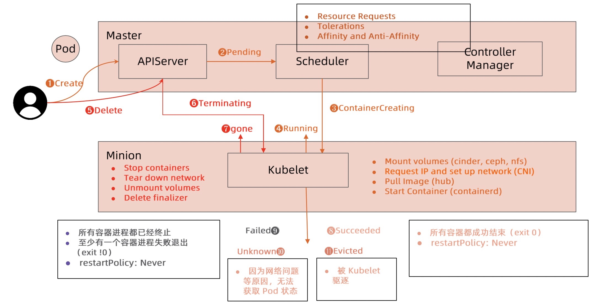
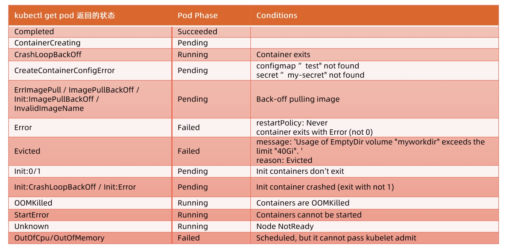
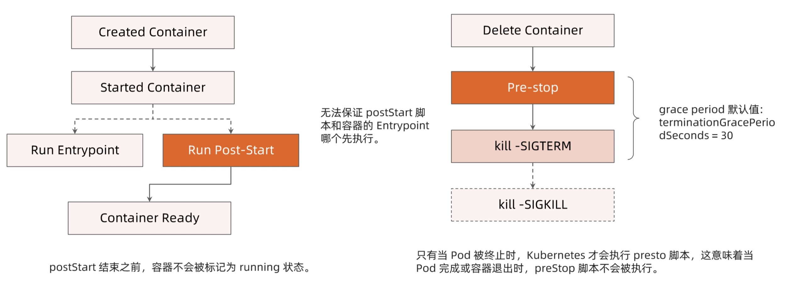
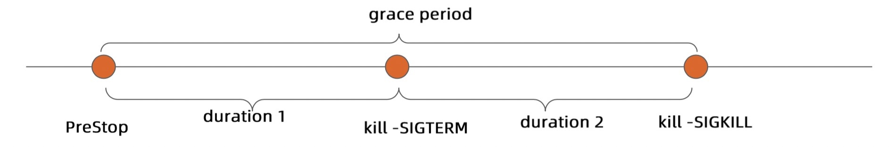

# 生命周期与服务发现

## 生命周期

### 状态计算

### 高可用

> 避免容器进程被终止，pod 被驱逐：
> - 设置合理的 resources.memory limits，防止容器进程被 OOMKill
> - 设置合理的 emptydir.sizeLimit 并且确保数据写入不超过 emptyDir 的限制，防止 pod 被驱逐

> Qos 分类：
> - Guaranteed: pod 的每个容器都设置了资源 CPU 和内存需求；limits 和 requests 的值完全一致
> - Burstable: 至少一个容器制定了 CPU 或者内存 request；pod 的资源需求不符合 Guaranteed Qos 的条件，也就是 request 与 limits 不一致
> - BestEffort: pod 中的所有容器都未指定 CPU 或内存资源需求 request

> 当计算节点检测到内存压力时，Kubernetes 会按 BestEffort -> Burstable -> Guaranteed 的顺序依次驱逐 pod

> 基于 Taint 的 Evictions
> - 增大 tolerationSeconds 以避免被驱逐

### Hook

> terminateGracePeriodSeconds 默认 30s

> 优雅处理进程
> - 正确处理系统信号量，将信号量转发给子进程
> - 在主进程退出之前，需要先等待并确保所有子进程退出
> - 监控并清理孤儿子进程

